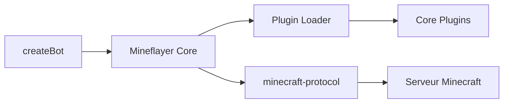

# PrismarineJS/mineflayer

> API JavaScript de haut niveau pour créer des bots Minecraft, aussi utilisable depuis Python.

## Le problème
Écrire un client Minecraft qui parle le protocole, suit le monde et bouge exige beaucoup de bas niveau.

## Ce que ça fait vraiment
Suit entités et blocs, gère physique, inventaire, craft, coffres, construction, chat. Prend en charge Minecraft 1.8 à 26.1. Système de plugins (pathfinder, PVP, viewer…). Repose sur des modules prismarine et minecraft-protocol.

## Comment c'est branché


## Essayer
```bash
npm install mineflayer
npm test
```

## Coût et pièges
Gratuit ; auth Microsoft ou mode hors ligne ; un serveur Minecraft est nécessaire. 518 issues ouvertes.

## Ce que ce n'est pas
Pas une IA : c'est une API d'interface, à laquelle il faut ajouter la logique.

## Alternatives
Aucune alternative nommée dans le README.

## Pour toi
Surveiller : sert de bac à sable pour agents LLM (Voyager, mindcraft, minecraft-mcp-server sont cités) ; utile si tu fais de l'IA agentique.

