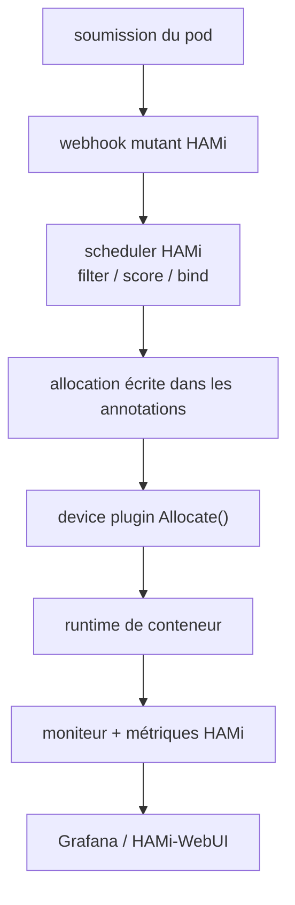

# Project-HAMi/HAMi

> Middleware Kubernetes de virtualisation GPU et d'ordonnancement d'accélérateurs hétérogènes.

## Le problème
Un GPU entier alloué à un notebook qui en utilise 3 Go, des équipes qui se disputent les cartes, et
un ordonnanceur qui ne sait rien de la topologie des devices : le taux d'utilisation s'effondre.

## Ce que ça fait vraiment
Permet de demander une fraction d'accélérateur par mémoire, cœurs ou nombre de devices, et applique
les limites de mémoire et de calcul par charge quand le backend du device le permet. Ordonnance avec
des politiques device-aware : binpack, spread, topology-aware, et MIG dynamique sur les cartes et
modes supportés. Couvre GPU NVIDIA, NPU, HCU, MLU et d'autres types (Ascend, Cambricon, Hygon,
Iluvatar, Kunlunxin, MetaX, Moore Threads) dans un même flux d'allocation. Aucune modification
applicative : on continue d'écrire des `requests`/`limits` Kubernetes standard. Expose des métriques
sur l'endpoint du moniteur de scheduler, avec dashboards Grafana et une WebUI. Projet CNCF en
incubation.

## Comment c'est branché


## Essayer
```bash
kubectl label nodes <node-name> gpu=on
helm repo add hami-charts https://project-hami.github.io/HAMi/
helm repo update
helm install hami hami-charts/hami -n kube-system
kubectl get pods -n kube-system
kubectl apply -f examples/nvidia/default_use.yaml
```
Demande d'un GPU avec 3 Gio plafonnés :
```yaml
resources:
  limits:
    nvidia.com/gpu: 1
    nvidia.com/gpumem: 3000
```

## Coût et pièges
Gratuit. Prérequis stricts côté NVIDIA : pilote ≥ 440, `nvidia-docker` > 2.0, NVIDIA en runtime par
défaut, Kubernetes ≥ 1.23, glibc ≥ 2.17, noyau ≥ 3.10, Helm > 3.0. Piège de sémantique : après
installation, `nvidia.com/gpu` sur le nœud vaut le nombre de vGPU, alors que dans un pod il désigne
le nombre de GPU physiques.

## Ce que ce n'est pas
Pas une isolation garantie partout : l'application des limites dépend du support par le backend du
device. Pas un remplaçant de scheduler : il s'insère dans le chemin kube-scheduler et se combine à
Volcano. Pas un outil de quota au sens facturation : cette couche reste à construire au-dessus.

## Alternatives
- NVIDIA GPU Operator : gère les pilotes et peut coexister, mais n'ordonnance pas de fractions.
- Volcano : gang scheduling et files de batch, complémentaire plutôt que concurrent.
- Kueue : mise en file de jobs, alimentée par les ressources HAMi via ResourceTransformation.

## Pour toi
La brique à connaître pour partager des GPU entre notebooks et entraînements sur un cluster.
