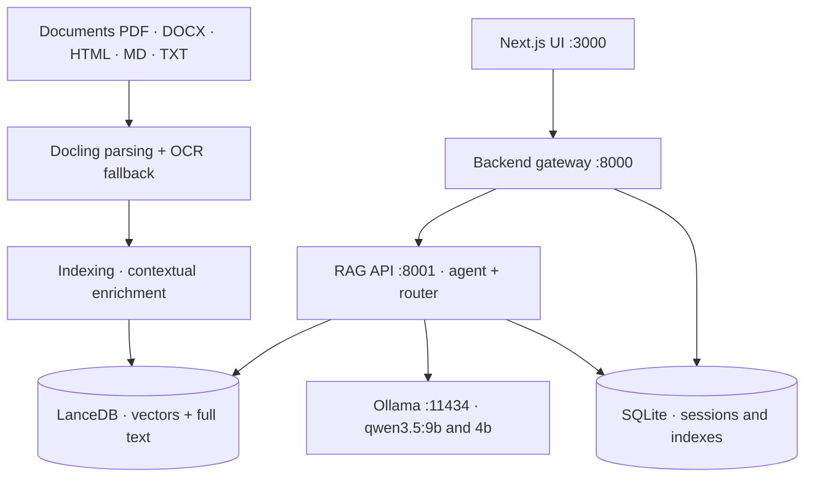

# PromtEngineer/localGPT

> **A fully local web app for question-answering over your own documents, backed by Ollama.**

## The problem

Querying your own documents with a language model normally means shipping the files to a
third-party provider, which rules out internal, contractual or regulated corpora. Building a
local chain yourself means assembling parsing, chunking, a vector store, full-text search,
reranking and a UI — then guessing which components are actually worth enabling.

## What it actually does

LocalGPT ships the whole chain plus its interface: PDF, DOCX, HTML, Markdown and TXT parsed by
Docling (with an OCR fallback when a PDF has no text layer), indexed into LanceDB, then queried
by hybrid search — a dense vector leg and LanceDB's native full-text leg, fused with Reciprocal
Rank Fusion, with no weights to tune.

A cross-encoder reranker (`Qwen/Qwen3-Reranker-4B` by default) arbitrates candidates with
calibrated score-based selection. A router decides per query between retrieval and a direct LLM
answer; query decomposition splits complex questions, retrieves per sub-question, then pools the
candidates for one rerank and one synthesis pass.

The claimed distinguishing feature is evaluation discipline: the repo states every component in
the default profile earned its place in a measured A/B, and several plausible options ship
**disabled** because they measurably did not — late chunking, answer verification, cross-ref
hops, document escalation, multi-vector retrieval. The harness and dated decision records live
in `eval/`.

Three access surfaces: a Next.js UI on port 3000, an HTTP gateway on 8000 (sessions, indexes,
uploads, chat history) and the RAG API on 8001 (indexing, retrieval, SSE streaming per pipeline
phase).

## How it is wired



No code-derived diagram ships with this repo: the graph is deduced from the README alone, using
the ports, services and paths it names — `run_system.py` launches the four processes,
`rag_system/main.py` holds every default, `backend/chat_data.db` and `./lancedb` hold the data.

## Trying it

```bash
git clone https://github.com/PromtEngineer/localGPT.git
cd localGPT

curl -fsSL https://ollama.ai/install.sh | sh
ollama pull qwen3.5:9b
ollama pull qwen3.5:4b
ollama serve

./start-docker.sh
open http://localhost:3000
```

Without Docker, the development path: `pip install -r requirements.txt`, `npm install`, then
`python run_system.py`, which manages the four services and writes their PIDs to
`logs/run_system.pid`. From the CLI, `python -m rag_system.main index ./my_documents` indexes a
directory and `python -m rag_system.main chat "What are the key findings?"` asks one question.
Diagnostics: `python system_health_check.py` (loads models, runs a sample query) or
`python run_system.py --health` (HTTP checks, non-zero exit on failure).

## Cost and traps

- **No API key required**: the software and the default models are local. The cost is hardware
  and disk, not a bill.
- **The README asks for 8GB RAM, 16GB recommended**, Python 3.10+ (3.11 advised), Node 20+, and
  Ollama for both deployment paths. The reranker weighs ~7.5GB, downloaded lazily on the first
  reranked query; the embedder 1.2GB. No VRAM requirement is documented: CUDA, then Apple MPS,
  then CPU are picked automatically.
- **Changing `EMBEDDING_MODEL` invalidates existing indexes**: vector width is read from the
  loaded model, and appending different-width vectors to a LanceDB table raises an error. The
  index must be deleted and rebuilt.
- **The RAG API is single-threaded**: requests are serialised, one chat or indexing run at a
  time. A long indexing run blocks the next call.
- **Streamed turns are persisted after the fact**: closing the browser mid-stream loses the turn.
- **Every command runs from the repository root**: relative paths (`backend/chat_data.db`,
  `lancedb/`, `index_store/`) resolve against the current working directory.
- **Two distinct tables**: `python -m rag_system.main index` writes to `text_pages_v4`, which is
  *not* the per-index table the web UI creates.
- **README vocabulary**: "state-of-the-art", "100% security", "Production-Ready" are the repo's
  own words, not measurements. The numbers that are actually backed live in `eval/`.

## What it is not

- **Not a library to import**: what ships is a four-service application with its UI, its SQLite
  database and its ports. You integrate over HTTP, not through `import`.
- **Not multimodal**: the README is explicit that vision models are not part of the pipeline.
  GLM-OCR or Qwen3-VL could be added as preprocessing but "are not integrated today". PDFs and
  OCR go through Docling.
- **Not a production-ready multi-user RAG**: single-threaded RAG API, synchronous indexing, and
  no authentication documented in the README. Privacy comes from everything running locally, not
  from access control.
- **Not a company project**: governance visibly rests on one person (personal X and Discord
  accounts, business contact via a Tally form).

## Alternatives

- **docling-project/docling** — named in the README, it is the parser LocalGPT uses. Prefer it
  when the need stops at extracting clean text and structure from PDFs, with no retrieval chain
  or interface.
- **opendatalab/MinerU** — a catalogue neighbour, also focused on document extraction.
  Comparable only at the parsing layer: prefer it when PDF extraction quality is the hard part,
  LocalGPT when querying is.
- **microsoft/harrier-oss-v1-0.6b and the Qwen3-Embedding family** are models the config treats
  as interchangeable, not alternatives to the application.

The other supplied neighbours (MemPalace/mempalace, Fosowl/agenticSeek, black-forest-labs/flux)
are not comparable: agent memory, an autonomous agent, and image generation.

## For you

The main draw is not the local RAG — there are many — but the `eval/` directory: five 24-question
corpora, a multi-turn set, verified paraphrases, a groundedness judge, and one dated decision
record per experiment. That is a reproducible ablation method worth borrowing for your own
pipelines, independently of the app. Worth watching for the methodology and as an offline test
bed; not worth adopting as a service building block, given the single-threaded RAG API and the
absence of authentication.
