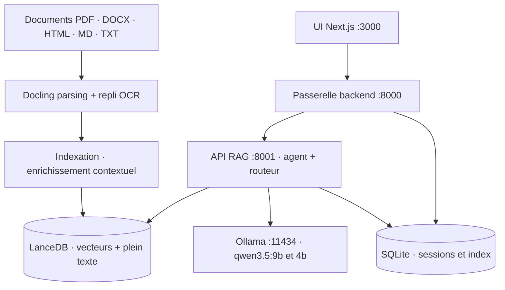

# PromtEngineer/localGPT

> **Une application web de questions-réponses sur documents, entièrement locale, adossée à Ollama.**

## Le problème

Interroger ses propres documents avec un modèle de langage suppose d'ordinaire d'envoyer les
fichiers chez un fournisseur tiers — ce qui ferme la porte aux corpus internes, contractuels
ou réglementés. À l'inverse, monter soi-même une chaîne locale demande d'assembler parsing,
découpage, base vectorielle, recherche plein texte, réordonnancement et interface, puis de
décider à l'aveugle quels composants méritent d'être activés.

## Ce que ça fait vraiment

LocalGPT livre la chaîne complète et son interface : parsing des PDF, DOCX, HTML, Markdown et
TXT par Docling (avec repli OCR quand le PDF n'a pas de couche texte), indexation dans LanceDB,
puis interrogation par une recherche hybride — branche vectorielle dense et recherche plein
texte native de LanceDB, fusionnées par Reciprocal Rank Fusion, sans poids à régler.

Un réordonnanceur cross-encoder (`Qwen/Qwen3-Reranker-4B` par défaut) arbitre les candidats
avec une sélection calibrée par score. Un routeur décide par requête entre passage par la
récupération et réponse directe du modèle ; la décomposition de question découpe les requêtes
complexes, récupère par sous-question, puis met en commun les candidats pour un seul
réordonnancement et une seule synthèse.

La particularité revendiquée est la discipline d'évaluation : le dépôt affirme que chaque
composant actif par défaut a gagné sa place dans un A/B mesuré, et que plusieurs options
plausibles sont livrées **désactivées** parce qu'elles n'ont rien apporté — late chunking,
vérification de réponse, sauts de références croisées, escalade documentaire, récupération
multi-vecteurs. Le harnais et les décisions datées vivent dans `eval/`.

Trois surfaces d'accès : une interface Next.js sur le port 3000, une passerelle HTTP sur 8000
(sessions, index, téléversements, historique) et l'API RAG sur 8001 (indexation, récupération,
flux SSE par phase de pipeline).

## Comment c'est branché



Aucun diagramme tiré du code n'accompagne ce dépôt : ce schéma est déduit du README, en
reprenant les ports, les services et les chemins qu'il nomme (`run_system.py` lance les quatre
processus, `rag_system/main.py` porte toute la configuration par défaut, `backend/chat_data.db`
et `./lancedb` reçoivent les données).

## Essayer

```bash
git clone https://github.com/PromtEngineer/localGPT.git
cd localGPT

curl -fsSL https://ollama.ai/install.sh | sh
ollama pull qwen3.5:9b
ollama pull qwen3.5:4b
ollama serve

./start-docker.sh
open http://localhost:3000
```

Sans Docker, la voie de développement : `pip install -r requirements.txt`, `npm install`, puis
`python run_system.py` — le lanceur gère les quatre services et écrit leurs PID dans
`logs/run_system.pid`. Côté ligne de commande, `python -m rag_system.main index ./my_documents`
indexe un dossier et `python -m rag_system.main chat "What are the key findings?"` pose une
question. Diagnostic : `python system_health_check.py` (charge les modèles et joue une requête)
ou `python run_system.py --health` (vérifications HTTP, sortie non nulle si un service échoue).

## Coût et pièges

- **Aucune clé d'API n'est requise** : le logiciel et les modèles par défaut sont locaux. Le
  coût est en matériel et en disque, pas en facture.
- **Le README exige 8 Go de RAM, 16 Go recommandés**, Python 3.10+ (3.11 conseillé), Node 20+,
  et Ollama pour les deux modes de déploiement. Le réordonnanceur pèse ~7,5 Go, téléchargé
  paresseusement à la première requête réordonnancée ; l'embedder 1,2 Go. Aucune exigence de
  VRAM n'est documentée : CUDA, puis MPS, puis CPU sont choisis automatiquement.
- **Changer `EMBEDDING_MODEL` invalide les index existants** : la largeur des vecteurs est lue
  sur le modèle chargé, et ajouter des vecteurs d'une autre largeur à une table LanceDB lève une
  erreur. Il faut supprimer l'index et le reconstruire.
- **L'API RAG est mono-thread** : les requêtes sont sérialisées, un chat ou une indexation à la
  fois. Une longue indexation bloque la suivante.
- **Un tour de conversation diffusé en flux n'est enregistré qu'après coup** : fermer le
  navigateur pendant le flux perd le tour.
- **Toutes les commandes se lancent depuis la racine du dépôt** : les chemins relatifs
  (`backend/chat_data.db`, `lancedb/`, `index_store/`) se résolvent sur le répertoire courant.
- **Deux tables distinctes** : `python -m rag_system.main index` écrit dans `text_pages_v4`, qui
  n'est *pas* la table par index créée par l'interface web.
- **Vocabulaire du README** : « state-of-the-art », « 100% security », « Production-Ready » —
  ces formules sont du dépôt, pas des mesures. Les chiffres réellement étayés sont dans `eval/`.

## Ce que ce n'est pas

- **Ce n'est pas une bibliothèque à importer** : l'objet livré est une application à quatre
  services avec son interface, sa base SQLite et ses ports. On l'intègre par HTTP, pas par
  `import`.
- **Ce n'est pas multimodal** : le README est explicite, les modèles de vision ne font pas partie
  du pipeline. GLM-OCR ou Qwen3-VL pourraient être ajoutés en pré-traitement mais « ne sont pas
  intégrés aujourd'hui ». Le PDF et l'OCR passent par Docling.
- **Ce n'est pas un RAG multi-utilisateurs prêt pour la production** : mono-thread côté API RAG,
  indexation synchrone, aucune authentification documentée dans le README. La confidentialité
  vient du fait que tout tourne en local, pas d'un contrôle d'accès.
- **Ce n'est pas un projet d'entreprise** : gouvernance visiblement portée par une personne
  (compte X et Discord personnels, contact commercial via un formulaire Tally).

## Alternatives

- **docling-project/docling** — nommé dans le README, c'est le parseur que LocalGPT utilise.
  À préférer si le besoin s'arrête à extraire proprement du texte et de la structure depuis des
  PDF, sans chaîne de récupération ni interface.
- **opendatalab/MinerU** — voisin du catalogue, également centré sur l'extraction documentaire.
  Comparable seulement sur l'étage parsing : à préférer quand la difficulté est la qualité
  d'extraction des PDF, LocalGPT quand la difficulté est l'interrogation.
- **microsoft/harrier-oss-v1-0.6b et la famille Qwen3-Embedding** sont des modèles mentionnés
  comme interchangeables dans la configuration, pas des alternatives à l'application.

Les autres voisins fournis (MemPalace/mempalace, Fosowl/agenticSeek, black-forest-labs/flux)
ne sont pas comparables : mémoire d'agent, agent autonome et génération d'images.

## Pour toi

L'intérêt principal n'est pas le RAG local — il en existe beaucoup — mais le dossier `eval/` :
cinq corpus de 24 questions, un jeu multi-tours, des paraphrases vérifiées, un juge de
groundedness et une décision datée par expérience. C'est une méthode d'ablation reproductible
à reprendre pour ses propres pipelines, indépendamment de l'application. À surveiller donc pour
la méthodologie et comme base d'essai hors ligne ; à ne pas adopter comme brique de service,
l'API RAG mono-thread et l'absence d'authentification y font obstacle.
