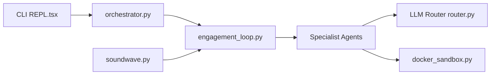

# PurpleAILAB/Decepticon

> Agent de red team autonome piloté par LLM, pour équipes offensives autorisées travaillant sous règles d'engagement.

## Le problème
Les exercices de red team sont longs, manuels et difficiles à documenter. Les démos « IA + sécurité » se limitent souvent à lancer un scanner et imprimer un rapport.

## Ce que ça fait vraiment
- Génère d'abord un dossier d'engagement (ConOps, règles d'engagement, plan de déconfliction, OPPLAN aligné MITRE ATT&CK) via `soundwave.py`.
- Une boucle d'orchestration (`engagement_loop.py`) prend chaque objectif, lance un agent spécialisé au contexte neuf et classe le résultat : réussi, bloqué ou en attente.
- 16 agents par phase, exécutés dans un bac à sable Kali isolé sur un réseau dédié ; les constats vont dans un graphe Neo4j.
- Des garde-fous (`middleware/`) et une journalisation servent de piste d'audit.

## Comment c'est branché


## Essayer
```bash
curl -fsSL https://decepticon.red/install | bash
decepticon onboard   # Interactive setup wizard (provider, API key, model profile)
decepticon           # Start the core stack and drop into the terminal CLI
pip install decepticon              # core SDK
pip install "decepticon[neo4j]"     # + the knowledge-graph attack-chain tools
```

## Coût et pièges
Docker et Docker Compose v2 requis ; clé d'API d'un fournisseur LLM (ou abonnement OAuth) à ta charge, la facture dépend du profil (eco, max, test). Le script d'installation est passé par `curl | bash`.

## Ce que ce n'est pas
Ce n'est pas un scanner ni un outil grand public : le README exige une autorisation écrite explicite du propriétaire du système, sans quoi l'usage est illégal. Le SDK pip ne suffit pas : il faut les services d'exécution (proxy LLM, sandbox). Licence non déclarée dans le catalogue.

## Alternatives
- Strix, PentestGPT, MAPTA, Cyber-AutoAgent : comparés dans le README du dépôt (page de benchmark), à évaluer selon ton cas.

## Pour toi
Surveiller : intéressant comme étude d'agents autonomes multi-rôles avec garde-fous, mais domaine offensif, licence non déclarée et usage strictement réservé à des missions autorisées, donc peu utile pour un profil data / MLOps.
