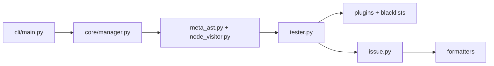

# PyCQA/bandit

> Linter de sécurité pour code Python, à brancher en CI ou en pre-commit.

## Le problème
Les failles courantes en Python (injection shell ou SQL, secrets en dur, désérialisation dangereuse, TLS mal configuré) passent en revue de code sans détection automatique.

## Ce que ça fait vraiment
Bandit parcourt chaque fichier, construit l'AST et applique des plugins sur les nœuds, sans exécuter le code. Une seconde mécanique, les blacklists, interdit des appels et imports. Les résultats sortent en texte, JSON, YAML, CSV, XML, HTML ou SARIF. Un mode baseline masque les findings déjà acceptés.

## Comment c'est branché


## Essayer
```bash
docker pull ghcr.io/pycqa/bandit/bandit
```
Le README ne documente pas la commande pip ni l'appel CLI : il renvoie à la documentation en ligne.

## Coût et pièges
Gratuit. Image signée avec cosign, multi-architecture. Le README renvoie au Read the Docs pour l'usage réel.

## Ce que ce n'est pas
Pas une analyse dynamique ni un audit de dépendances : uniquement l'analyse statique de l'AST de votre code. 258 issues ouvertes : des faux positifs sont à attendre et à filtrer par baseline.

## Alternatives
Aucune alternative nommée dans le README.

## Pour toi
À adopter : un scan de sécurité statique de tes scripts et pipelines Python en CI coûte presque rien, et l'outil est mûr (Apache-2.0, poussé fin août 2026).

