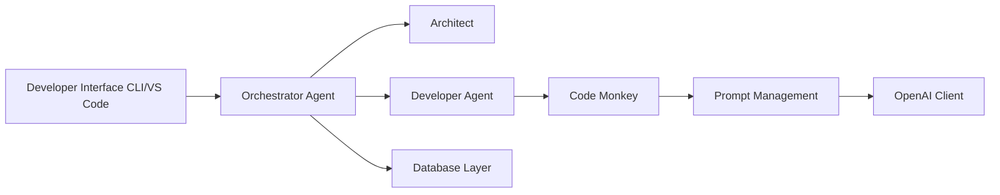

# Pythagora-io/gpt-pilot

> Outil CLI d'agents LLM qui génèrent une application pas à pas, désormais non maintenu.

## Le problème
Les générateurs de code produisent tout d'un bloc, ce qui rend les bugs difficiles à corriger.

## Ce que ça fait vraiment
Chaîne d'agents (Spec Writer, Architect, Tech Lead, Developer, Code Monkey, Reviewer, Troubleshooter, Debugger, Technical Writer) orchestrée depuis `main.py`.
Appelle OpenAI, Anthropic ou Groq ; stocke l'état en SQLite (ou PostgreSQL) et le code dans `workspace/`.
Ne montre au LLM que le code pertinent pour la tâche en cours.
Moteur de l'extension VS Code Pythagora.

## Comment c'est branché


## Essayer
```bash
git clone https://github.com/Pythagora-io/gpt-pilot.git
cd gpt-pilot
python3 -m venv venv
source venv/bin/activate
pip install -r requirements.txt
cp example-config.json config.json
python main.py
```

## Coût et pièges
**Un ver voleur d'identifiants (core/telemetry/) a été présent d'août 2025 au 11 juin 2026** : si tu l'as lancé depuis les sources, fais tourner tous tes secrets. Clé LLM à ta charge.

## Ce que ce n'est pas
Plus maintenu (« This repo is not being maintained anymore »), d'où la compromission restée inaperçue. Pas un générateur autonome : un développeur doit superviser.

## Alternatives
- Smol developer : cité comme approche concurrente, génère la base de code d'un bloc.
- GPT engineer : idem.

## Pour toi
À fuir ; utile seulement comme étude de cas d'attaque de chaîne d'approvisionnement.
