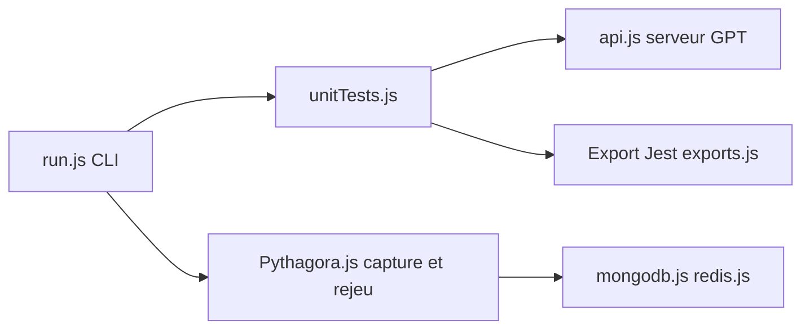

# Pythagora-io/pythagora

> Outil Node qui génère des tests unitaires Jest avec GPT-4, déclaré obsolète au profit de GPT Pilot.

## Le problème
Écrire des tests unitaires pour des fonctions JavaScript est long et laisse des cas limites non couverts.

## Ce que ça fait vraiment
Trouve la fonction visée et ses dépendances par analyse AST, envoie le tout au serveur Pythagora qui génère les tests avec GPT-4, exportés en Jest. Peut aussi étendre une suite existante. Le code contient de plus un mode d'enregistrement et de rejeu du trafic HTTP, MongoDB et Redis pour des tests d'intégration. Le README est ouvert par un avertissement : dépôt déprécié.

## Comment c'est branché


## Essayer
```bash
npm i pythagora --save-dev
npx pythagora --config --openai-api-key <API_KEY>
npx pythagora --unit-tests --func <FUNCTION_NAME>
npx jest ./pythagora_tests/
```

## Coût et pièges
Clé OpenAI ou Pythagora à ta charge. Le code est envoyé à OpenAI, le README le reconnaît. Seuls les tests Jest sont produits. Sous Windows, utiliser Git Bash.

## Ce que ce n'est pas
Pas maintenu : le dépôt est déprécié. Les tests générés se relisent : dans l'exemple du README, 17 sur 145 échouent et 6 étaient mal écrits. Annoncé « alpha ».

## Alternatives
GPT Pilot est cité comme le projet qui remplace ce dépôt.

## Pour toi
Ignorer : dépôt déclaré déprécié, dépendant de GPT-4 et limité à Jest ; utilise plutôt le projet de remplacement s'il t'intéresse.

