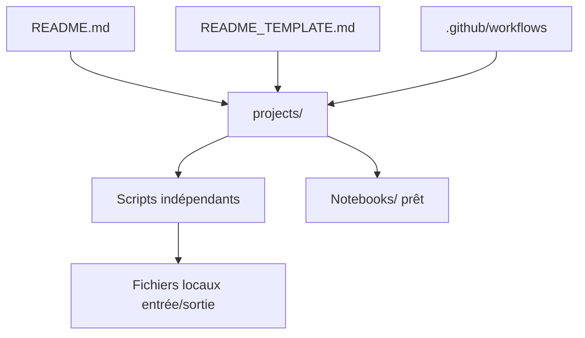

# Python-World/python-mini-projects

> Collection de petits scripts Python indépendants, pour débutants qui apprennent en contribuant à l'open source.

## Le problème
Un débutant manque d'exercices concrets et d'un premier dépôt où pousser une contribution.

## Ce que ça fait vraiment
Le README ne décrit que la procédure de contribution (fork, branche, README de dossier, pull request). D'après l'architecture, `projects/` contient des dizaines de scripts sans lien entre eux : convertisseurs JSON/CSV, todo Flask, scraping, bot Telegram, envoi de mails, plus un notebook de prédiction de remboursement de prêt. Chaque dossier a ses propres dépendances.

## Comment c'est branché


## Essayer
```bash
git clone https://github.com/<your-github-username>/python-mini-projects.git
git checkout -b <branch-name>
git push origin <branch-name>
```

## Coût et pièges
Gratuit. Dépôt archivé, dernier push en 2022. Certains dossiers contiennent des fichiers d'identifiants (`credentials.txt`, `config.ini`) : ne jamais y mettre de vrais secrets.

## Ce que ce n'est pas
Ce n'est pas une bibliothèque ni un projet maintenu : la qualité varie d'un script à l'autre et rien n'est garanti.

## Alternatives
Le README ne cite pas d'alternative.

## Pour toi
À ignorer : archivé, sans valeur pour un profil confirmé ; utile seulement comme source d'idées d'exercices.

