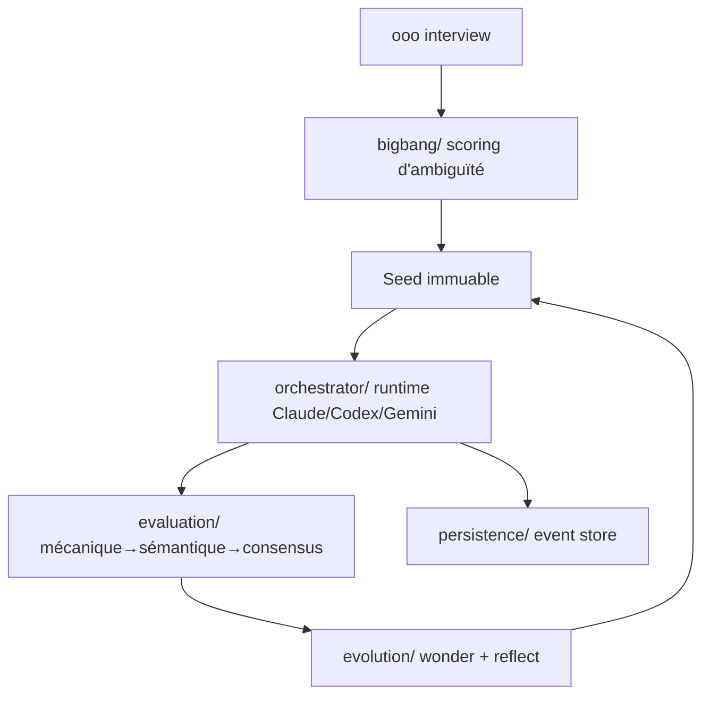

# Q00/ouroboros

> Couche de spécification qui force un agent de code à clarifier l'intention avant d'écrire.

## Le problème
Un prompt vague part en code : l'agent devine, l'architecture dérive, et les hypothèses fausses n'apparaissent qu'à la relecture de la PR.
Rien ne garde la trace de ce qui a été décidé d'une session à l'autre.

## Ce que ça fait vraiment
Un entretien socratique interroge la demande et produit un score d'ambiguïté ; sous 0,2 le passage au code est bloqué sans `force`.
Les réponses sont figées dans un « Seed » immuable (critères d'acceptation, ontologie, contraintes), puis exécutées par décomposition Double Diamond.
Une porte d'évaluation en trois étages (mécanique, sémantique, consensus multi-modèles) juge le résultat, et la boucle « evolve » réinjecte le verdict dans la génération suivante.
Un journal d'événements (SQLAlchemy + aiosqlite) rejoue l'historique, ce qui permet à `ooo ralph` de reprendre après un redémarrage machine.

## Comment c'est branché


## Essayer
```bash
curl -fsSL https://raw.githubusercontent.com/Q00/ouroboros/main/scripts/install.sh | OUROBOROS_INSTALL_REF=readme bash
# puis, dans une session d'agent :
ooo setup
ooo interview "I want to build a task management CLI"
# ou depuis un terminal nu :
ouroboros init start --orchestrator "I want to build a task management CLI tool"
```

## Coût et pièges
Le paquet est gratuit mais chaque étape appelle un modèle : la facture reste celle de ton abonnement Claude/Codex ou de tes clés. Python ≥ 3.12 obligatoire, LiteLLM limité à 3.12–3.13.
Windows natif est déclaré expérimental et Codex CLI y exige WSL 2 ; en dessous de la 0.51.1 l'installation MCP échoue au démarrage.

## Ce que ce n'est pas
Ce n'est pas un agent de code : il ne produit rien seul, il pilote celui que tu as déjà. Ce n'est pas un gain de vitesse — l'entretien ajoute un tour avant toute écriture.
Le routeur « 1x/10x/30x » optimise le coût, il ne le supprime pas. Treize hôtes sont annoncés mais seuls ceux installés chez toi sont câblés.

## Alternatives
- `Ouro-labs/ourocode` : le shell terminal du même stack, si tu veux une TUI unifiée plutôt que le noyau.
- `Ouro-labs/ouroboros-plugins` : pour empaqueter des workflows métier au lieu du moteur brut.
- `razzant/ouroboros` : projet homonyme non affilié, agent auto-modifiant — l'inverse de l'approche spec-first.

## Pour toi
À regarder si tes prompts d'agent dérivent sur des tâches longues ; l'ajout de treize intégrations sonne comme de la course à la surface.
