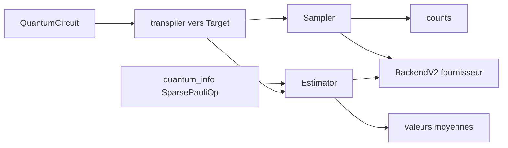

# Qiskit/qiskit

> **The base SDK for building, compiling and running quantum circuits from Python.**

## The problem

Without this layer, writing a quantum algorithm means speaking the gate set and connectivity
of one specific machine, and rewriting everything when the hardware vendor changes. There is
also no standard way to get either measurement counts or observable expectation values out of
the same circuit.

## What it actually does

The repository ships the building blocks: the `QuantumCircuit` class, quantum operators via
`qiskit.quantum_info` such as `SparsePauliOp`, and the `Sampler` and `Estimator` primitives —
the first samples measurement outcomes, the second estimates expectation values. It includes a
transpiler with synthesis, optimization, mapping and scheduling passes that rewrites a circuit
to the basis gates and `coupling_map` of a given target, plus a default compiler. It also
defines the `BaseSamplerV2`, `BaseEstimatorV2` and `BackendV2` interfaces that providers
implement. Two public APIs coexist: the Python one, which is primary, and a C API exposing the
internal Rust data model, usable as a `libqiskit.so` shared library or from the Python package
to write extension modules. The bundled simulators are `StatevectorSampler` and
`StatevectorEstimator`, which the README itself says will not take you very far.

## How it is wired



You build a circuit, then either add measurements with `measure_all` or pair it with an
observable. The transpiler maps the circuit onto a `Target` built from `basis_gates` and a
`CouplingMap`. Primitives then execute it, locally with the statevector simulators, or on
hardware through a runtime or a third-party `BackendV2`.

## Trying it

```bash
pip install qiskit
```

For the standalone C library, building from source is currently the only option, with the Rust
compiler and GNU Make installed:

```bash
make c
```

The output lands in `dist/c` at the root of the repository.

## Cost and traps

The package is free and `pip` resolves dependencies. The README states a minimum rustc 1.89
for source or C-API builds, and a supported Python version range. The real cost is elsewhere:
the bundled simulators run on classical CPUs and do not scale, so serious use implies real
hardware, reached through a third-party runtime — the only one named is
`Qiskit/qiskit-ibm-runtime` — or a vendor provider. The README documents no price, quota or
access terms for those machines; that has to be checked with each provider, and that is where
the bill shows up.

## What it is not

It is not access to quantum hardware: this repository stops at the interfaces, real execution
goes through a separate package. It is not a high-performance simulator either — the two
statevector primitives are illustrative. And it is not a ready-made algorithm framework: you
get circuits, operators, primitives and a transpiler, not application recipes, which live in
the surrounding ecosystem and the external documentation.

## Alternatives

The README names no competitor, only Qiskit extensions — `qiskit-ibm-runtime`, `qiskit-ionq`,
`qiskit-braket-provider`, `qiskit-rigetti` — which complete this repository rather than replace
it. Among the catalogue neighbours, `quantumlib/Cirq` covers the same ground from a Google
rather than IBM angle, and `PennyLaneAI/pennylane` leans towards differentiable quantum
computing and quantum machine learning.

## For you

Genuinely interesting only if quantum computing is an acknowledged research or watch topic:
nothing here slots into a classical data or MLOps pipeline, and moving to real hardware adds an
external provider and an undocumented cost. Worth knowing as the field's reference, worth a
closer look if the topic turns into a project.
