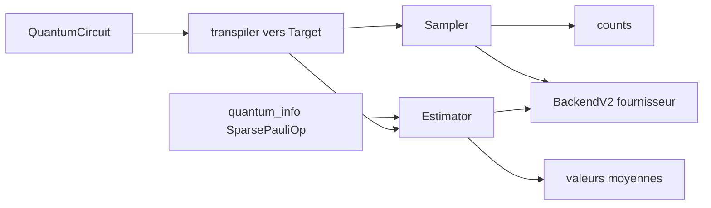

# Qiskit/qiskit

> **Le SDK de base pour écrire, compiler et exécuter des circuits quantiques depuis Python.**

## Le problème

Sans cette couche, écrire un algorithme quantique suppose de parler directement le jeu de
portes et la topologie de connexion d'une machine précise, et de tout réécrire dès qu'on
change de fournisseur de matériel. Il n'existe pas non plus de façon standard d'obtenir des
comptages d'échantillons ou des valeurs moyennes d'observables à partir d'un même circuit.

## Ce que ça fait vraiment

Le dépôt fournit les briques de base : la classe `QuantumCircuit` pour construire un circuit,
les opérateurs quantiques via `qiskit.quantum_info` — par exemple `SparsePauliOp` — et les
primitives `Sampler` et `Estimator`, la première échantillonnant des résultats de mesure, la
seconde estimant des valeurs moyennes. Il embarque un transpileur avec des passes de synthèse,
d'optimisation, de placement et d'ordonnancement, qui réécrit un circuit vers les portes de
base et la `coupling_map` d'une cible donnée, plus un compilateur par défaut. Il définit enfin
les interfaces `BaseSamplerV2`, `BaseEstimatorV2` et `BackendV2` que les fournisseurs
implémentent. Deux API publiques coexistent : l'API Python, primaire, et une API C exposant le
modèle de données interne écrit en Rust, utilisable en bibliothèque partagée `libqiskit.so`
ou depuis le paquet Python pour écrire des modules d'extension. Les simulateurs livrés ici
sont `StatevectorSampler` et `StatevectorEstimator`, que le README décrit lui-même comme ne
menant « pas très loin ».

## Comment c'est branché



On construit un circuit, on ajoute soit des mesures via `measure_all`, soit un observable. Le
transpileur adapte le circuit à une `Target` construite depuis `basis_gates` et une
`CouplingMap`. Les primitives exécutent ensuite, localement avec les simulateurs statevector,
ou sur du matériel via un runtime ou un `BackendV2` tiers.

## Essayer

```bash
pip install qiskit
```

Pour la bibliothèque C autonome, seule la compilation depuis les sources est proposée, avec le
compilateur Rust et GNU Make installés :

```bash
make c
```

Le résultat est placé dans `dist/c` à la racine du dépôt.

## Coût et pièges

Le paquet est gratuit et `pip` gère les dépendances. Le README annonce un rustc minimum 1.89
pour compiler depuis les sources ou construire l'API C, et une plage de versions de Python
imposée. Le vrai coût est ailleurs : les simulateurs fournis tournent sur CPU classique et ne
passent pas à l'échelle, donc l'usage sérieux suppose du matériel réel, accessible par un
runtime tiers — le seul cité est `Qiskit/qiskit-ibm-runtime` — ou un provider vendeur. Le
README ne documente ni prix, ni quota, ni conditions d'accès à ces machines : c'est à vérifier
chez chaque fournisseur, et c'est là que la facture apparaît.

## Ce que ce n'est pas

Ce n'est pas un accès au matériel quantique : le dépôt s'arrête aux interfaces, l'exécution
réelle passe par un paquet séparé. Ce n'est pas non plus un simulateur performant — les deux
primitives statevector servent d'illustration. Enfin, ce n'est pas un framework d'algorithmes
prêts à l'emploi : on y trouve circuits, opérateurs, primitives et transpileur, pas des
recettes applicatives, qui vivent dans l'écosystème et la documentation externe.

## Alternatives

Le README ne nomme aucun concurrent, seulement des extensions Qiskit — `qiskit-ibm-runtime`,
`qiskit-ionq`, `qiskit-braket-provider`, `qiskit-rigetti` — qui complètent ce dépôt plutôt
qu'ils ne le remplacent. Parmi les voisins du catalogue, `quantumlib/Cirq` couvre le même
terrain avec un ancrage Google plutôt qu'IBM, et `PennyLaneAI/pennylane` vise plutôt le calcul
quantique différentiable et l'apprentissage automatique quantique.

## Pour toi

Intérêt réel seulement si le quantique est un sujet de veille ou de recherche assumé : rien
ici ne s'insère dans une chaîne data ou MLOps classique, et le passage au matériel réel ajoute
un fournisseur externe et un coût non documenté. À connaître comme référence du domaine, à
regarder de près si le sujet devient un projet.
