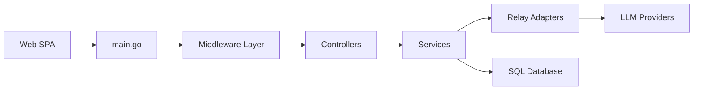

# QuantumNous/new-api

> Passerelle IA auto-hébergée qui unifie plusieurs fournisseurs de LLM derrière une API, pour équipes.

## Le problème
Chaque client doit être reconfiguré à chaque changement de fournisseur, et les quotas, clés et coûts sont éparpillés.

## Ce que ça fait vraiment
Expose les API OpenAI (Chat, Responses), Anthropic Messages et Gemini, avec conversion entre protocoles (RelayKit).
Routage par canaux avec priorités, poids, retries et clés multiples.
Quotas, abonnements, journaux d'usage, tarification ; utilisateurs, groupes, OAuth/OIDC, 2FA.
Backend Go/Gin, console React ; SQLite, MySQL ou PostgreSQL, Redis optionnel.

## Comment c'est branché


## Essayer
```bash
mkdir -p data
docker run --name new-api -d --restart unless-stopped \
  -p 127.0.0.1:3000:3000 \
  -e TZ=Asia/Shanghai \
  -v "$(pwd)/data:/data" \
  calciumion/new-api:latest
curl --fail-with-body http://localhost:3000/v1/models \
  -H "Authorization: Bearer ${NEW_API_KEY}"
```

## Coût et pièges
Clés amont à ta charge et à obtenir légalement. En production : HTTPS, `SESSION_SECRET` persistant, Redis partagé en multi-nœud.

## Ce que ce n'est pas
Pas un fournisseur de modèles. La conversion entre protocoles n'est pas toujours exacte. AGPL-3.0.

## Alternatives
- One API : projet d'origine dont New API est dérivé.

## Pour toi
Utile pour centraliser l'accès LLM d'une équipe ; attention à l'AGPL si tu l'exposes.
