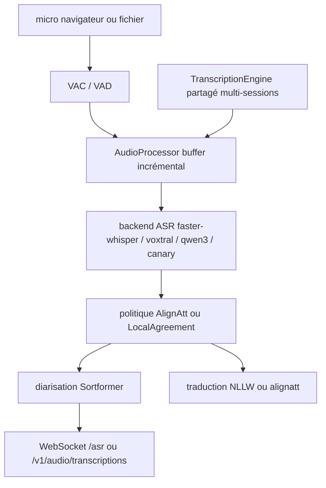

# QuentinFuxa/WhisperLiveKit

> Serveur de transcription et traduction en flux, avec diarisation, API compatibles OpenAI et Deepgram.

## Le problème
Whisper est fait pour des énoncés complets : le découper en petits morceaux perd le contexte et coupe les mots en deux.
Passer en temps réel demande une politique de décodage simultané, pas seulement un découpage plus fin.

## Ce que ça fait vraiment
Implémente des politiques de streaming issues de la recherche : SimulStreaming/AlignAtt, LocalAgreement, Sortformer pour la diarisation, NLLW pour la traduction vers 200 langues, AlignAtt4LLM pour la traduction par LLM décodeur seul.
Backends ASR interchangeables : faster-whisper, whisper, mlx-whisper, `openai-api`, FunASR/SenseVoiceSmall, Voxtral (MLX ou HF), Qwen3-ASR (vLLM, vLLM Metal, ou HF streaming avec mode causal), Canary-1b-v2 via NeMo.
Trois surfaces réseau : REST compatible OpenAI (`/v1/audio/transcriptions`), WebSocket compatible Deepgram, WebSocket natif `/asr` avec paramètres par session (`language`, `target_language`, `context`, `mode=diff`, `token`).
CLI `wlk` pour servir, transcrire un fichier, générer des SRT, gérer les modèles et mesurer (`wlk bench`) ; VAD/VAC pour réduire le coût quand personne ne parle.

## Comment c'est branché


## Essayer
```bash
pip install whisperlivekit
wlk --model base --language en
wlk run whisper:tiny
wlk transcribe meeting.wav
wlk transcribe --format srt podcast.mp3 -o podcast.srt
wlk models
wlk bench
uv sync --extra cu129 --extra diarization-sortformer
docker build -t wlk .
docker run --gpus all -p 8000:8000 --name wlk wlk
gunicorn -k uvicorn.workers.UvicornWorker -w 4 your_app:app
```

## Coût et pièges
Gratuit et local, mais plusieurs extras lourds sont incompatibles entre eux et doivent vivre dans des environnements séparés — la liste de référence est `[tool.uv].conflicts` dans `pyproject.toml`.
Le mode causal Qwen3 est anglais uniquement ; `--language auto` biaise vers l'anglais ; la diarisation Diart est limitée à Python 3.11-3.12 et demande d'accepter les conditions pyannote puis `huggingface-cli login`. Prévoir une session temps réel par GPU.

## Ce que ce n'est pas
Pas un simple wrapper Whisper : le README explique pourquoi appeler Whisper sur chaque lot ne marche pas.
Pas un outil à locuteurs simultanés : Sortformer produit des probabilités recouvrantes, mais chaque token est attribué à un seul locuteur.
Pas un service hébergé : les compatibilités OpenAI et Deepgram sont des sous-ensembles, pas les API complètes.

## Alternatives
- Simul-Whisper, WhisperStreaming, Streaming Sortformer, NLLB/NLLW, Qwen3-ASR-causal : les travaux dont il implémente les politiques.

## Pour toi
Le meilleur candidat de ce lot pour de la transcription temps réel auto-hébergée ; commence par un seul profil d'extras.
