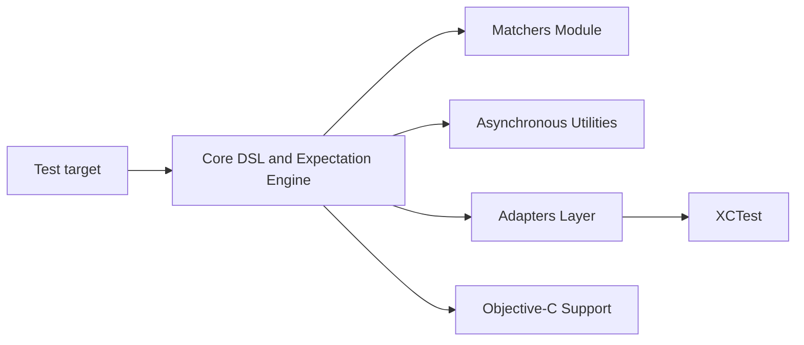

# Quick/Nimble

> Bibliothèque de matchers pour exprimer les attentes des tests Swift et Objective-C.

## Le problème
Les assertions XCTest sont verbeuses ; on veut des attentes lisibles, y compris asynchrones.

## Ce que ça fait vraiment
Un DSL `expect(...).to(...)` s'appuie sur `Expectation`/`Expression` et un grand jeu de matchers. Des adaptateurs relient XCTest et Swift Testing, une couche Objective-C sert les tests ObjC, et des helpers gèrent `toEventually`. Installation par Swift Package Manager, CocoaPods, Carthage ou sous-modules git.

## Comment c'est branché


## Essayer
```bash
pod install
```
(après ajout de `pod 'Nimble'` au Podfile ; version SwiftPM : `.package(url: "https://github.com/Quick/Nimble.git", from: "13.0.0")`).

## Coût et pièges
Gratuit. `raiseException` n'est pas disponible via Swift Package Manager. À lier à la cible de test, pas à l'app.

## Ce que ce n'est pas
Pas un framework de test complet : il complète XCTest ; le README le présente aussi comme compagnon de Quick. Aucune télémétrie, précise-t-il.

## Alternatives
- Quick : projet frère, style BDD, s'installe avec Nimble.

## Pour toi
À ignorer pour un profil data/IA/MLOps : c'est un outil de test Swift/iOS sans lien avec ton domaine.

