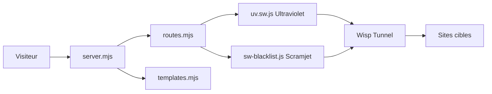

# QuiteAFancyEmerald/InvisiProxy

> Proxy web auto-hébergeable qui contourne les filtres de navigation, destiné surtout aux élèves et aux étudiants.

## Le problème
Des réseaux, extensions ou pare-feu locaux bloquent l'accès à certains sites. Le projet propose de les atteindre malgré ce filtrage.

## Ce que ça fait vraiment
Un serveur web (fastify) sert des pages et des service workers qui font transiter la navigation par deux moteurs de proxy navigateur, Ultraviolet et Scramjet, via le protocole Wisp. Il ajoute un blocage de publicités, la personnalisation de l'onglet, le routage Tor/SOCKS5 optionnel et des jeux web. Les options de « camouflage » (randomisation de la source, masquage du DOM) visent à éviter la détection par les filtres. L'implémentation du routage Tor et du blocage de pub n'est pas visible dans l'architecture décrite.

## Comment c'est branché


## Essayer
```bash
git clone https://github.com/QuiteAFancyEmerald/InvisiProxy.git
cd InvisiProxy
pnpm run fresh-install
pnpm run fetch-adblock
pnpm start
```

## Coût et pièges
Node 20.x, git, curl et NGINX (pas Caddy, précisé par le README) ; un VPS ou un hébergeur est nécessaire pour un usage réel. Branche master instable : le README recommande la branche production.

## Ce que ce n'est pas
Ce n'est pas un outil data/IA. Les « liens officiels » passent par le Discord de la communauté. Le contournement de filtres peut enfreindre le règlement d'un établissement, d'un employeur ou la loi locale ; l'usage relève de la responsabilité de l'hébergeur et de l'utilisateur. Le README se dit « expérimental » et « preuve de concept ».

## Alternatives
- Ultraviolet : le moteur de proxy utilisé en interne, à prendre seul si besoin d'une brique.
- Scramjet : l'autre moteur intégré, meilleure gestion des CAPTCHA selon le README.
- Incognito : autre proxy cité par l'auteur dans son message de 2022.

## Pour toi
Ignorer : c'est un proxy de contournement de filtres sans rapport avec des pipelines data, IA ou MLOps, avec des risques de conformité pour un poste professionnel.

