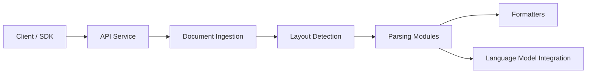

# QuivrHQ/MegaParse

> Parseur de documents (PDF, Word, PowerPoint, Excel, CSV) vers du texte structuré, avec option vision LLM.

## Le problème
Extraire proprement tableaux, titres et mise en page de documents variés avant un pipeline RAG.

## Ce que ça fait vraiment
Bibliothèque Python avec plusieurs parseurs (unstructured, doctr, LlamaParse, MegaParse Vision), détection de mise en page par modèles ONNX, formateurs de tableaux. Existe aussi en API (Makefile, docs sur localhost:8000). Le README publie un benchmark interne où MegaParse Vision obtient 0,87 de similarité.

## Comment c'est branché


## Essayer
```bash
pip install megaparse
make dev
python evaluations/script.py
```

## Coût et pièges
Poppler et Tesseract à installer (libmagic sur Mac). Clé OpenAI ou Anthropic pour le mode vision, donc envoi de tes documents à un tiers. Benchmark fourni par les auteurs.

## Ce que ce n'est pas
Pas garanti « sans perte » : c'est un objectif annoncé. Les chantiers (post-traitement modulaire, sortie structurée) sont encore en cours.

## Alternatives
- unstructured et llama_parser : comparés dans le benchmark du README.

## Pour toi
À surveiller : intéressant en amont d'un RAG, à tester sur tes propres documents avant de croire le benchmark.
