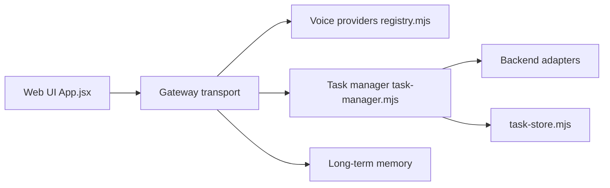

# QwenAudio/qwen-audio-agent

> Runtime de voix temps réel qui laisse converser pendant qu'un agent de code travaille en arrière-plan.

## Le problème
Un agent vocal classique se tait dès qu'il appelle un outil ou lance une tâche longue.

## Ce que ça fait vraiment
Une passerelle relie un frontal vocal temps réel (Qwen Audio, OpenAI Realtime, Gemini Live, Doubao, StepAudio, ou Hugging Face Speech-to-Speech en local) à un agent backend via ACP (Qwen Code, OpenCode, Claude Code, Codex, etc.). Les questions simples sont traitées tout de suite ; le reste est délégué, suivi et le résultat revient dans la conversation. Interfaces : WebUI, TUI, bulle flottante de bureau, mémoire longue par utilisateur.

## Comment c'est branché


## Essayer
```bash
npm install -g qwen-audio-agent
qwenaudio config
qwenaudio        # Terminal 1 : Gateway
qwenaudio tui    # Terminal 2 : TUI
```

## Coût et pièges
Clé DashScope (Bailian) par défaut, ou clé du fournisseur choisi ; facturation selon leurs règles. Node 22.22.2+ ou 24.15.0+.

## Ce que ce n'est pas
Pas un modèle vocal : il orchestre des services voix existants. Les cas cockpit, embarqué et livestream sont partiellement « prévus ».

## Alternatives
Aucune alternative nommée dans le README.

## Pour toi
À surveiller : le motif « conversation + tâches asynchrones » est instructif pour des agents vocaux, mais le dépôt est récent (créé en juillet 2026) et dépend de clés cloud.

