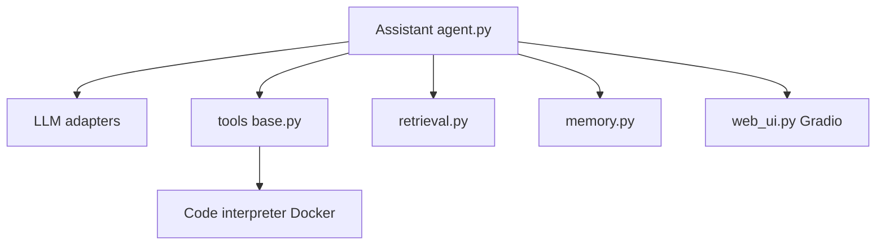

# QwenLM/Qwen-Agent

> Framework Python d'agents LLM (outils, RAG, MCP) pensé pour les modèles Qwen.

## Le problème
Pour construire un agent qui appelle des outils, lit des documents et exécute du code, il faut écrire soi-même le parsing du function calling de chaque modèle.

## Ce que ça fait vraiment
Il fournit les classes `Agent`, `BaseChatModel` et `BaseTool`, avec function calling, appels en parallèle et outils MCP.
Les outils intégrés couvrent la recherche, le RAG sur documents longs et un code interpreter dans Docker.
Il gère la mémoire, les multi-agents (`multi_agent_hub.py`) et une interface Gradio (`WebUI`).
Il fonctionne avec DashScope ou tout endpoint compatible OpenAI (vLLM, Ollama). C'est le backend de Qwen Chat.

## Comment c'est branché


## Essayer
```bash
pip install -U "qwen-agent[gui,rag,code_interpreter,mcp]"
pip install -U qwen-agent
```

## Coût et pièges
Il faut une clé DashScope (`DASHSCOPE_API_KEY`) ou un serveur de modèles à héberger soi-même. Le code interpreter exige Docker, et le README signale que son isolation est seulement « basique ».

## Ce que ce n'est pas
Ce n'est pas un framework agnostique : il est optimisé pour Qwen. Le dernier push date du 2026-03-04 et il y a 538 issues ouvertes.

## Alternatives
Le README ne nomme aucun dépôt alternatif.

## Pour toi
À surveiller : c'est un bon choix si tu déploies des Qwen via vLLM, mais pour un projet multi-fournisseurs d'autres frameworks restent plus neutres.
