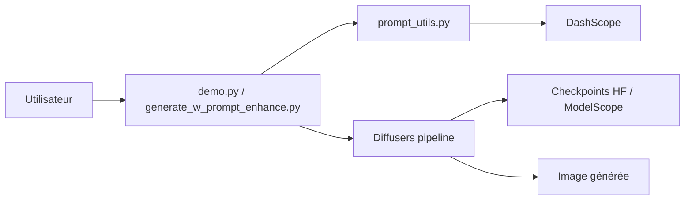

# QwenLM/Qwen-Image

> Modèle ouvert de 20B pour générer et éditer des images, surtout avec du texte dedans.

## Le problème
Les modèles d'image open source rendent mal le texte, surtout le chinois, et éditent une image sans garder l'identité du sujet.

## Ce que ça fait vraiment
Le dépôt contient de la doc, des scripts d'exemple et des utilitaires de réécriture de prompt : les poids et le moteur sont ailleurs (Diffusers, checkpoints `Qwen/Qwen-Image*`).
Il couvre plusieurs variantes : T2I, Edit, Edit-2509/2511 (multi-images), 2512 (réalisme).
`prompt_utils.py` réécrit les prompts via DashScope (service Qwen, en option).
`demo.py` lance un serveur Gradio multi-GPU avec une file d'attente.

## Comment c'est branché


## Essayer
```bash
pip install git+https://github.com/huggingface/diffusers
cd src
DASHSCOPE_API_KEY=sk-xxxxxxxxxxxxxxxxx python examples/demo.py
```

## Coût et pièges
Il faut un GPU conséquent (20B paramètres ; DiffSynth annonce une inférence possible sous 4 Go avec offload). L'amélioration de prompt exige une clé DashScope payante.

## Ce que ce n'est pas
Pas de code d'entraînement ni d'implémentation du modèle ici. Le support LoRA/finetuning dans Diffusers est annoncé « à venir ».

## Alternatives
- DiffSynth-Studio : offload basse VRAM, FP8, entraînement LoRA.
- SGLang-Diffusion : servir le modèle dès sa sortie.
- cache-dit : accélérer l'inférence par cache.

## Pour toi
À surveiller : c'est une vraie option ouverte pour générer ou éditer des visuels contenant du texte, mais son usage réel passe par Diffusers et exige un GPU.
