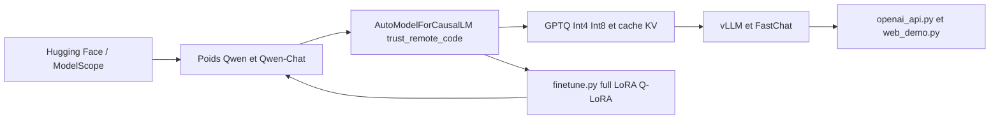

# QwenLM/Qwen

> **First-generation Qwen repo: 1.8B to 72B weights, inference and finetuning code, frozen.**

## The problem

Running and adapting an open bilingual Chinese/English LLM otherwise means assembling weights,
loading code, quantization, finetuning scripts and an API server yourself. This README gathers
those pieces for one model family instead of scattering them.

## What it actually does

Publishes the base models **Qwen-1.8B / 7B / 14B / 72B** and the matching **Qwen-Chat** models on
Hugging Face and ModelScope, plus Int4 and Int8 quantized variants. The README lists, per size,
the context length (32K, except 8K for Qwen-14B), pretraining tokens (2.2T to 3.0T) and measured
minimum VRAM: 5.8GB to Q-LoRA finetune Qwen-1.8B, 61.4GB for Qwen-72B; 2.9GB to 48.9GB to
generate 2048 Int4 tokens. The repo carries the surrounding code: loading via
`AutoModelForCausalLM` with `trust_remote_code=True`, GPTQ and KV-cache quantization,
`finetune.py` scripts (full-parameter, LoRA, Q-LoRA, DeepSpeed/FSDP), vLLM and FastChat
deployment, web and CLI demos, an OpenAI-style API server, `qwenllm/qwen` Docker images, ReAct
prompting for tool use, and announced inference support on Ascend 910 and Hygon DCU. A banner at
the top states this repo is no longer actively maintained and points to `QwenLM/Qwen2`.

## How it is wired



Entry point is downloading weights from Hugging Face or ModelScope. Repo code loads them with
`trust_remote_code=True`, then three paths branch off: quantization (GPTQ Int4/Int8, KV cache),
finetuning (`finetune/finetune_ds.sh`, `finetune_lora_single_gpu.sh`,
`finetune_qlora_single_gpu.sh`) which produces new weights, and serving (vLLM, FastChat,
`openai_api.py`, `web_demo.py`, `cli_demo.py`).

## Trying it

```bash
pip install -r requirements.txt
# streaming CLI demo
python cli_demo.py
# web demo
pip install -r requirements_web_demo.txt
python web_demo.py
# OpenAI-style API
pip install fastapi uvicorn "openai<1.0" pydantic sse_starlette
python openai_api.py
# single-GPU LoRA finetuning
pip install "peft<0.8.0" deepspeed
bash finetune/finetune_lora_single_gpu.sh
```

The README requires python 3.8+, pytorch 1.12+ (2.0+ recommended), transformers 4.32+ and CUDA
11.4+ on GPU. flash-attention is described as optional.

## Cost and traps

Weights and code are free, but the bill is VRAM: per the README's table, 48.9GB to generate with
Qwen-72B in Int4, 61.4GB to Q-LoRA finetune it. The README warns there is no single-GPU
full-parameter training script, that DeepSpeed may conflict with pydantic >= 2.0, that Q-LoRA
only supports fp16 and must start from the Int4 models, and that Hugging Face may drop `*.cpp`
and `*.cu` files from saved checkpoints. Licensing trap: the code is Apache 2.0, but the
Qwen-7B/14B/72B weights fall under the Tongyi Qianwen LICENSE AGREEMENT with a form to fill in
for commercial use, and Qwen-1.8B under a research license requiring contact. Alibaba's DashScope,
offered as a hosted route, is a third-party service needing an account.

## What it is not

Not the current Qwen: the README itself announces maintenance has stopped in favour of
`QwenLM/Qwen2`, so this is an archive card rather than a starting point in 2026. Not a general
inference framework either — it leans on transformers, vLLM and FastChat. And "open source" does
not mean free for commercial use: only the code is, not the weights. The README also notes RLHF
is not released.

## Alternatives

`QwenLM/Qwen2`, named in the README, is the direct successor and the only sensible pick for a new
project. `huggingface/transformers` covers generic loading and inference if you only want to
consume the weights. `hiyouga/LlamaFactory` replaces the `finetune/*.sh` scripts with a
multi-model finetuning toolchain that is still maintained.

## For you

Mostly historical and documentary value: the VRAM and throughput tables remain a useful reference
for sizing an inference server. For real deployment, start from Qwen2 and check the weight
licence before any commercial use.
