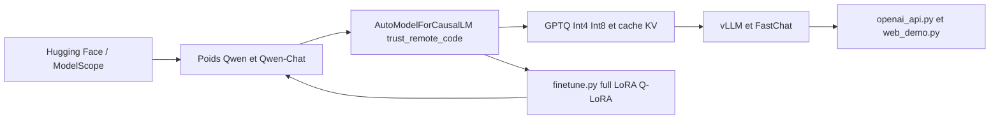

# QwenLM/Qwen

> **Dépôt de la première génération Qwen : poids 1.8B à 72B, code d'inférence et de finetuning, figé.**

## Le problème

Faire tourner et adapter un LLM ouvert bilingue chinois/anglais suppose de rassembler soi-même
poids, code de chargement, quantification, scripts de finetuning et serveur d'API. Le README
regroupe ces briques pour une même famille de modèles, au lieu de les éparpiller.

## Ce que ça fait vraiment

Publie les modèles de base **Qwen-1.8B / 7B / 14B / 72B** et les modèles de chat
**Qwen-Chat** correspondants, sur Hugging Face et ModelScope, plus des variantes quantifiées
Int4 et Int8. Le README donne pour chaque taille la longueur de contexte (32K sauf Qwen-14B à
8K), le nombre de tokens de pré-entraînement (2.2T à 3.0T) et la VRAM minimale mesurée :
5.8 Go pour finetuner Qwen-1.8B en Q-LoRA, 61.4 Go pour Qwen-72B ; 2.9 Go à 48.9 Go pour
générer 2048 tokens en Int4. Le dépôt fournit le code autour : chargement via
`AutoModelForCausalLM` avec `trust_remote_code=True`, quantification GPTQ et quantification du
cache KV, scripts `finetune.py` (full-parameter, LoRA, Q-LoRA, DeepSpeed/FSDP), déploiement
vLLM et FastChat, démos Web et CLI, serveur d'API façon OpenAI, images Docker `qwenllm/qwen`,
prompting ReAct pour l'usage d'outils, et un support d'inférence annoncé sur Ascend 910 et
Hygon DCU. Un encadré en tête du README indique que ce dépôt n'est plus activement maintenu et
renvoie vers `QwenLM/Qwen2`.

## Comment c'est branché



Le point d'entrée est le téléchargement des poids depuis Hugging Face ou ModelScope. Le code du
dépôt charge ces poids via `trust_remote_code=True`, puis trois chemins partent de là : la
quantification (GPTQ Int4/Int8, cache KV), le finetuning (`finetune/finetune_ds.sh`,
`finetune_lora_single_gpu.sh`, `finetune_qlora_single_gpu.sh`) qui reproduit des poids, et le
service (vLLM, FastChat, `openai_api.py`, `web_demo.py`, `cli_demo.py`).

## Essayer

```bash
pip install -r requirements.txt
# démo CLI en streaming
python cli_demo.py
# démo web
pip install -r requirements_web_demo.txt
python web_demo.py
# API compatible OpenAI
pip install fastapi uvicorn "openai<1.0" pydantic sse_starlette
python openai_api.py
# finetuning LoRA sur un seul GPU
pip install "peft<0.8.0" deepspeed
bash finetune/finetune_lora_single_gpu.sh
```

Le README exige python 3.8+, pytorch 1.12+ (2.0+ recommandé), transformers 4.32+ et CUDA 11.4+
côté GPU. flash-attention est présenté comme optionnel.

## Coût et pièges

Les poids et le code sont gratuits, mais la facture est en VRAM : selon le tableau du README,
48.9 Go pour générer en Int4 avec Qwen-72B, 61.4 Go pour le finetuner en Q-LoRA. Le README
avertit qu'il ne fournit pas de script d'entraînement mono-GPU en full-parameter, que DeepSpeed
peut entrer en conflit avec pydantic ≥ 2.0, que Q-LoRA n'accepte que fp16 et doit partir des
modèles Int4, et que Hugging Face peut omettre des fichiers `*.cpp`/`*.cu` du checkpoint
sauvegardé. Piège de licence : le code est en Apache 2.0, mais les poids Qwen-7B/14B/72B
relèvent du « Tongyi Qianwen LICENSE AGREEMENT » avec formulaire à remplir pour un usage
commercial, et Qwen-1.8B d'une licence recherche imposant de contacter l'éditeur. Le service
DashScope d'Alibaba, mentionné comme alternative hébergée, est un service tiers à compte.

## Ce que ce n'est pas

Ce n'est pas la version courante de Qwen : le README annonce lui-même l'arrêt de la maintenance
au profit de `QwenLM/Qwen2`, une fiche d'archive plutôt qu'un choix de démarrage en 2026. Ce
n'est pas non plus un framework généraliste d'inférence — il s'appuie sur transformers, vLLM et
FastChat. Enfin, « open source » ne veut pas dire libre d'usage commercial : seul le code l'est,
pas les poids. Le README précise aussi que le RLHF n'est pas publié.

## Alternatives

`QwenLM/Qwen2`, nommé dans le README, est la suite directe et le seul choix raisonnable pour un
nouveau projet. `huggingface/transformers` couvre le chargement et l'inférence de façon générique
si on ne veut que consommer les poids. `hiyouga/LlamaFactory` remplace les scripts
`finetune/*.sh` par un outillage de finetuning multi-modèles encore maintenu.

## Pour toi

Intérêt surtout historique et documentaire : les tableaux de VRAM et de vitesse restent une
référence utile pour dimensionner un serveur d'inférence. Pour un déploiement réel, partir de
Qwen2 et vérifier la licence des poids avant tout usage commercial.
