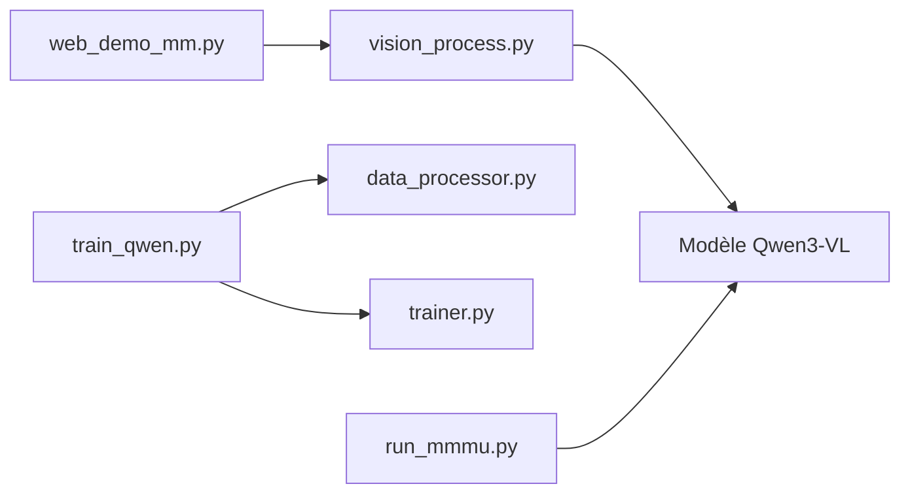

# QwenLM/Qwen2-VL

> Dépôt du modèle vision-langage Qwen3-VL (texte, image, vidéo), pour développeurs d'applications multimodales.

## Le problème
Lire documents, images et vidéos avec un LLM demande un modèle multimodal et un pipeline de prétraitement adaptés.

## Ce que ça fait vraiment
Publie Qwen3-VL (denses et MoE, éditions Instruct et Thinking) : OCR en 32 langues, grounding 2D/3D, agent GUI, contexte 256K extensible à 1M, vidéo. Le dépôt contient des exemples transformers, l'outil `qwen-vl-utils`, un démo web, du fine-tuning et des évaluations (MMMU, MathVision, ODinW, RealWorldQA, VideoMME). Déploiement via vLLM ou SGLang.

## Comment c'est branché


## Essayer
```bash
pip install "transformers>=4.57.0"
pip install qwen-vl-utils==0.0.14
pip install -r requirements_web_demo.txt
python web_demo_mm.py -c /your/path/to/qwen3vl/weight
```

## Coût et pièges
GPU requis ; le modèle 235B exige un serveur multi-GPU (exemple vLLM sur H100 avec tensor-parallel 8). L'API DashScope demande une clé. Le tableau de VRAM du README porte sur Qwen2.5-VL.

## Ce que ce n'est pas
Ce n'est pas seulement Qwen2-VL malgré le nom du dépôt : le README est celui de Qwen3-VL. Cookbooks annoncés « en préparation ».

## Alternatives
Non documenté : le README ne nomme pas d'alternative.

## Pour toi
Adopter pour OCR et extraction sur documents : Apache-2.0 et versions de tailles variées ; prévois un GPU suffisant.

