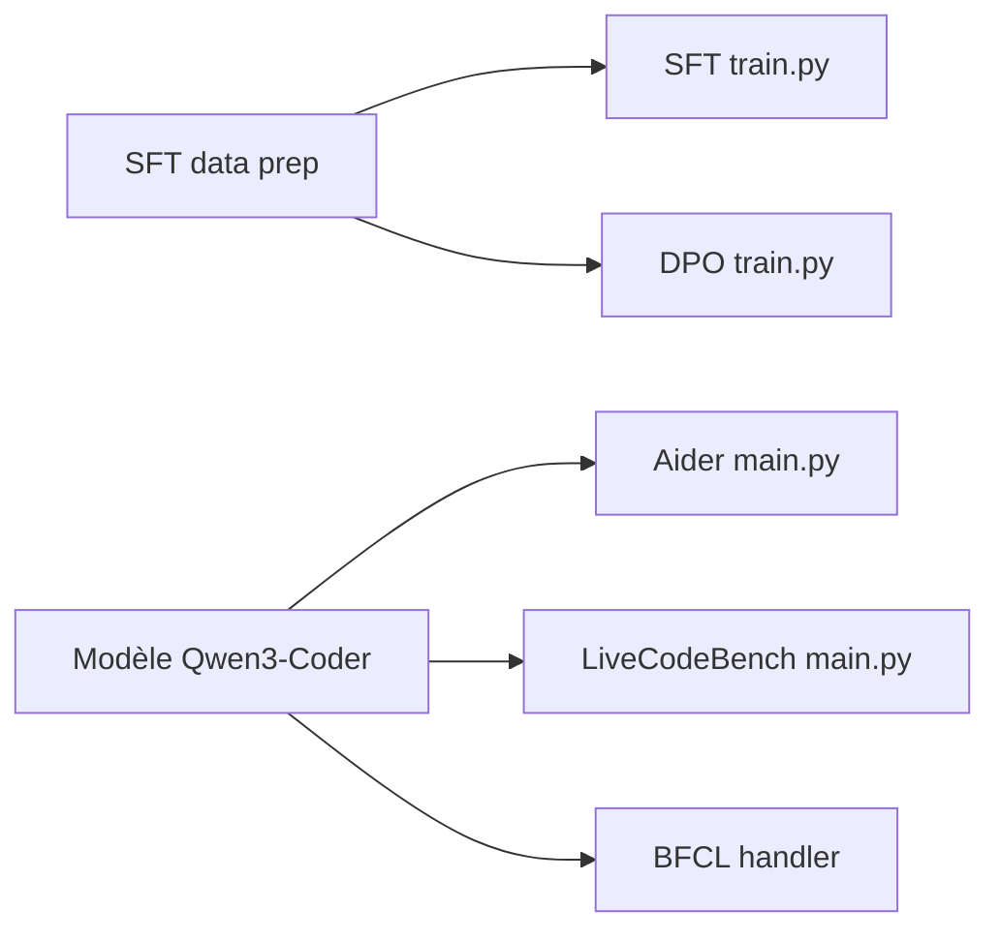

# QwenLM/Qwen2.5-Coder

> Dépôt des modèles de code Qwen3-Coder et des outils d'entraînement et d'évaluation associés.

## Le problème
Un modèle de code pour agents doit gérer long contexte, appels d'outils et dizaines de langages.

## Ce que ça fait vraiment
Annonce Qwen3-Coder (480B-A35B, 30B-A3B, Next) : 256K de contexte extensible à 1M via YaRN, 358 langages, fill-in-the-middle, appels d'outils pour Qwen Code, Cline, Claude Code. Le dépôt contient le fine-tuning (SFT, DPO) et des suites d'évaluation (Aider, Bird-Spider, LiveCodeBench, CRUXEval, BFCL, Tau).

## Comment c'est branché


## Essayer
```python
from transformers import AutoModelForCausalLM, AutoTokenizer
model_name = "Qwen/Qwen3-Coder-Next"
model = AutoModelForCausalLM.from_pretrained(model_name, torch_dtype="auto", device_map="auto")
tokenizer = AutoTokenizer.from_pretrained(model_name)
```

## Coût et pièges
GPU et mémoire importants. Le parseur d'outils exige vLLM ou SGLang. Aucune licence déclarée sur le dépôt : droits d'usage à vérifier.

## Ce que ce n'est pas
Ce n'est pas le Qwen2.5-Coder du nom du dépôt : le README présente Qwen3-Coder. Ce n'est pas une application finie.

## Alternatives
Non documenté : le README ne nomme pas d'alternative.

## Pour toi
Surveiller : modèle de code ouvert pour agents, mais l'absence de licence sur le dépôt impose de lire les licences des poids avant usage.

