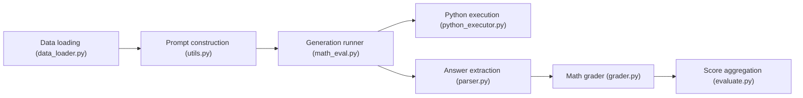

# QwenLM/Qwen2.5-Math

> Famille de modèles Qwen spécialisés en mathématiques (CoT et TIR), en anglais et en chinois, pour chercheurs.

## Le problème
Les LLM généralistes résolvent mal les problèmes de maths de niveau compétition et n'exploitent pas bien le calcul par code.

## Ce que ça fait vraiment
Publie des modèles de base 1,5B/7B/72B, leurs versions instruct et un modèle de récompense 72B (Qwen2.5-Math-RM-72B). Deux modes : chaîne de pensée et raisonnement intégrant du code Python (TIR). Le dépôt contient aussi le harnais d'évaluation (chargement de jeux, prompts, exécuteur Python, extraction et comparaison de réponses, vote majoritaire et RM).

## Comment c'est branché


## Essayer
```bash
cd latex2sympy
pip install -e .
cd ..
pip install -r requirements.txt
bash sh/eval.sh $PROMPT_TYPE $MODEL_NAME_OR_PATH
```
Inférence : `transformers>=4.37.0`, modèle `Qwen/Qwen2.5-Math-72B-Instruct`.

## Coût et pièges
Le 72B demande plusieurs GPU (la commande d'éval en utilise 4). La reproduction exige des versions figées (`vllm==0.5.1`, `transformers` 4.42.3). Dépôt sans licence déclarée ; dernier push en janvier 2025.

## Ce que ce n'est pas
Les auteurs déconseillent ces modèles pour toute autre tâche que les maths. Les scores cités sont ceux des auteurs.

## Alternatives
Aucune alternative nommée dans le README.

## Pour toi
À surveiller : utile comme référence de modèle mathématique et de harnais d'éval, mais vérifie la licence des poids (non précisée ici) et note que le dépôt n'est plus actif.

