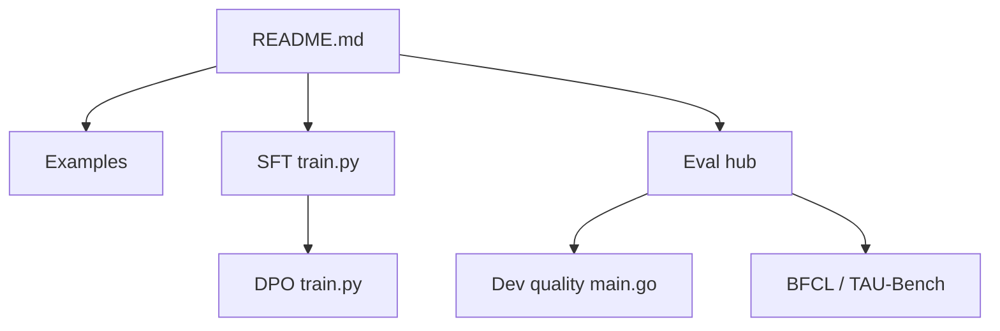

# QwenLM/Qwen3-Coder

> Page d'accueil des modèles de code Qwen3-Coder, à poids ouverts, avec leurs évaluations.

## Le problème
Il faut un modèle de code ouvert, capable de tenir un rôle d'agent, et qui tourne en local à un coût raisonnable.

## Ce que ça fait vraiment
Trois modèles : Qwen3-Coder-480B-A35B, 30B-A3B et Next (80B-A3B, attention hybride et MoE). Contexte de 256K, extensible à 1M.
Ils gèrent le FIM (`<|fim_prefix|>`) et un format d'appel d'outils dédié, avec des parsers pour SGLang et vLLM.
Le dépôt contient des exemples, des pipelines SFT/DPO et un large banc d'évaluation (`qwencoder-eval`, BFCL, TAU-Bench).
Les poids sont publiés sur Hugging Face et ModelScope.

## Comment c'est branché

## Essayer
Le README ne donne aucune commande shell. Il fournit seulement des exemples Python avec `transformers`.

## Coût et pièges
Les modèles sont gros : il faut de la VRAM, sauf à passer par les variantes FP8 ou GGUF. Les tokens spéciaux ont changé, il faut le nouveau tokenizer.

## Ce que ce n'est pas
Ce n'est pas un outil installable. Le dépôt ne contient pas les poids. Aucune licence n'est déclarée dans le catalogue.

## Alternatives
Le README ne nomme aucun dépôt alternatif. Il cite Qwen Code, CLINE et Claude Code comme clients compatibles.

## Pour toi
À surveiller : Qwen3-Coder-Next est un candidat sérieux pour un assistant de code local, mais vérifie la licence des poids avant tout usage.
