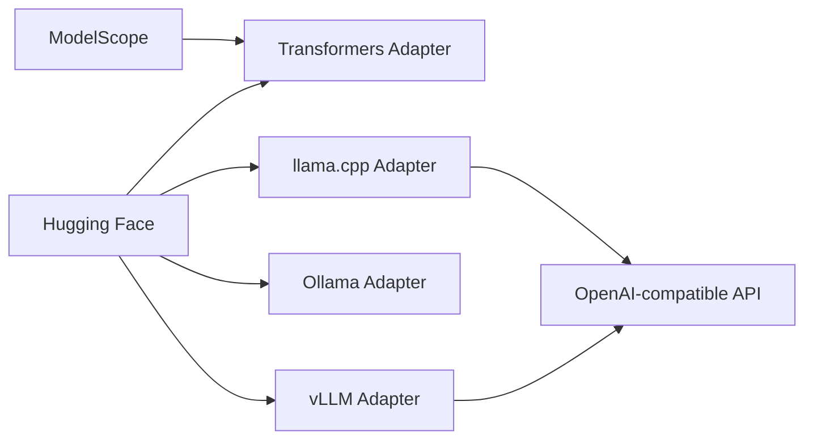

# QwenLM/Qwen3

> Dépôt de référence de la famille de LLM open-weight Qwen3 : doc, exemples d'inférence et déploiement.

## Le problème
Choisir et servir un LLM ouvert impose de connaître les bons paramètres par moteur (templates, raisonnement, contexte long).

## Ce que ça fait vraiment
Documente les modèles denses et MoE (0.6B à 235B-A22B) et la mise à jour 2507 (Instruct et Thinking, contexte 256K extensible à 1M).
Donne les snippets Transformers et les commandes pour llama.cpp, Ollama, SGLang, vLLM, TensorRT-LLM.
Explique le basculement thinking / non-thinking (`enable_thinking`, `/think`).
Les poids sont sur Hugging Face et ModelScope ; le dépôt contient docs, Dockerfiles et exemples.

## Comment c'est branché


## Essayer
```bash
ollama run qwen3:8b
vllm serve Qwen/Qwen3-8B --port 8000 --max-model-len 131072 --enable-reasoning --reasoning-parser qwen3
```

## Coût et pièges
Gratuit, mais GPU et mémoire importants pour les grandes tailles. Ollama a un `num_ctx` par défaut de 2048 à relever. vLLM/SGLang dégradent l'usage d'outils multi-étapes en mode thinking.

## Ce que ce n'est pas
Pas le code d'entraînement. Aucune licence déclarée au niveau du dépôt : vérifier celle de chaque checkpoint.

## Alternatives
- Qwen-Agent : surcouche recommandée pour l'usage d'outils et MCP.

## Pour toi
Adopter : famille de modèles ouverts de référence pour du local ou de l'auto-hébergé, avec des recettes de service prêtes pour vLLM et Ollama.
