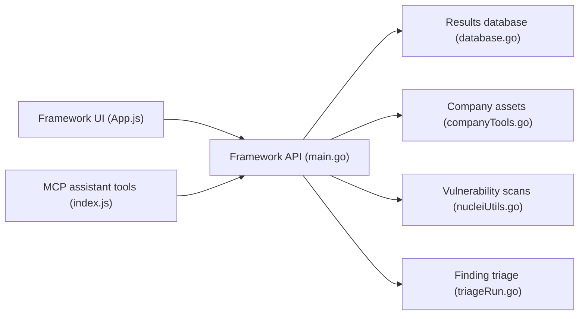

# R-s0n/ars0n-framework-v2

> Plateforme de bug bounty qui enveloppe 50+ outils de reconnaissance dans une méthodologie guidée.

## Le problème
Les débutants en bug bounty ne savent pas dans quel ordre enchaîner les outils ni quelles cibles prioriser après l'énumération.

## Ce que ça fait vraiment
Plus de 50 conteneurs Docker derrière un nginx : interface React, API Go, base PostgreSQL. Trois flux (société, joker, URL) enchaînent ASN, domaines, sous-domaines, serveurs actifs, nuclei, etc. Un score de ROI classe les cibles. Un serveur MCP de 142 outils (port 3001) permet à un assistant de lancer des scans. Le flux URL éducatif est encore en développement.

## Comment c'est branché


## Essayer
```bash
docker-compose up --build
curl http://localhost:3001/health
claude mcp add --transport sse ars0n-framework http://localhost:3001/sse
```

## Coût et pièges
Gratuit, mais 8 Go de RAM minimum, 30 à 60 minutes de premier build, et des clés (SecurityTrails, Censys, Shodan) payantes au-delà des quotas gratuits. Le serveur MCP est sans authentification par défaut (`MCP_AUTH_TOKEN` à définir).

## Ce que ce n'est pas
Ce n'est pas un outil générique de sécurité : il sert à tester des cibles autorisées. Version bêta 0.1.0 ; le flux URL pédagogique n'est pas terminé.

## Alternatives
Aucune alternative nommée dans le README.

## Pour toi
À ignorer : outil de reconnaissance offensive qui sort du périmètre data/IA/MLOps ; à n'utiliser que sur des cibles que tu es autorisé à tester.

