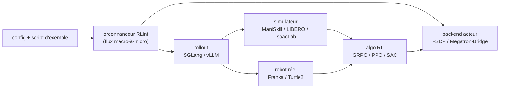

# RLinf/RLinf

> Infrastructure d'apprentissage par renforcement distribué pour IA incarnée et agents, multi-simulateurs.

## Le problème
Faire du RL sur des politiques VLA ou des agents demande de coller un moteur d'inférence, un backend
d'entraînement, un simulateur et un ordonnanceur multi-nœuds — code jetable à chaque combinaison.

## Ce que ça fait vraiment
Fournit les workflows RL (PPO, GRPO, SAC, DAPO, IQL, DSRL…) en masquant la programmation distribuée,
et passe de 1 à N nœuds GPU sans modifier le code. Deux familles de backends : FSDP +
HuggingFace/SGLang/vLLM pour prototyper, Megatron + SGLang/vLLM pour l'échelle. Couvre SFT,
RL en simulation (ManiSkill, LIBERO, IsaacLab, RoboTwin, Genesis…) et RL réel (Franka, XSquare
Turtle2, DOS-W1) avec caméras et pinces déclarées. Le mode d'exécution hybride est annoncé à 2,434×
le débit des frameworks existants.

## Comment c'est branché

## Essayer
Aucune commande d'installation n'est écrite dans le README : il renvoie au guide d'installation et
recommande l'image Docker fournie (méthode 1), puis un exemple ManiSkill3 documenté ailleurs. Une
installation en bibliothèque via pip est annoncée depuis 2026/02, sans commande citée.

## Coût et pièges
Gratuit mais lourd : GPU obligatoires, environnement d'embodied RL décrit comme complexe — d'où
l'image Docker recommandée. Support annoncé pour MUSA (Moore Threads), CANN (Ascend) et ROCm, avec
une matrice modèle/environnement à vérifier avant de choisir son matériel.

## Ce que ce n'est pas
Pas un framework de RLHF texte généraliste : le centre de gravité est la robotique et les VLA. Pas
une API stable : la liste de nouveautés montre un rythme de rupture mensuel et des versions 0.x.

## Alternatives
Aucun concurrent nommé : le README cite ses briques (SGLang, vLLM, Megatron-Bridge, AgentLightning)
et ses adoptants, pas de remplaçants.

## Pour toi
À suivre de loin sauf si tu fais du RL robotique ; l'ingénierie système est le vrai apport.
