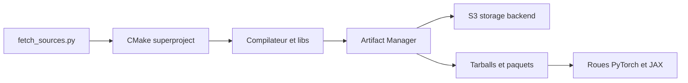

# ROCm/TheRock

> Système de build et de release de HIP et ROCm, avec nightlies PyTorch et JAX pour GPU AMD.

## Le problème
Construire ROCm à la main, composant par composant, est long et fragile ; installer des versions récentes de PyTorch sur GPU AMD l'est aussi.

## Ce que ça fait vraiment
Un super-projet CMake qui récupère les sources des composants ROCm, les compile (compilateur, bibliothèques math, communication, vision, ML, outils de debug) et publie tarballs, paquets Linux et roues Python. Nightlies ROCm, PyTorch et JAX. Depuis ROCm 7.14, ROCm est publié par ce dépôt. Linux et Windows natif.

## Comment c'est branché


## Essayer
```bash
git clone https://github.com/ROCm/TheRock.git
cd TheRock
python3 -m venv .venv && source .venv/bin/activate
pip install -r requirements.txt
python3 ./build_tools/fetch_sources.py
cmake -B build -GNinja . -DTHEROCK_AMDGPU_FAMILIES=gfx110X-all
cmake --build build
```

## Coût et pièges
Environ 200 Go de disque et plusieurs heures de compilation ; un échec de disque casse le build. Il faut choisir `THEROCK_AMDGPU_FAMILIES` ou `THEROCK_AMDGPU_TARGETS`. Le README recommande ccache et de préférer les releases quand elles existent.

## Ce que ce n'est pas
Ce n'est pas un installateur simple : pour utiliser ROCm sans le compiler, passer par la page Releases. 1 271 issues ouvertes.

## Alternatives
Aucune alternative nommée dans le README.

## Pour toi
Surveiller : les nightlies PyTorch/JAX sur AMD comptent si tu déploies sur GPU AMD ; le build complet reste un travail de contributeur.

