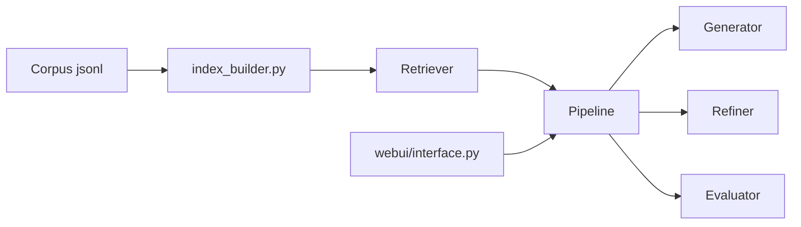

# RUC-NLPIR/FlashRAG

> Boîte à outils Python pour reproduire et comparer des méthodes de RAG, pour chercheurs et ingénieurs.

## Le problème
Les articles de RAG utilisent des corpus, index et prompts différents, ce qui rend les comparaisons et les reproductions pénibles.

## Ce que ça fait vraiment
Des composants (retrievers dense et BM25, rerankers, refiners, générateurs avec vLLM ou FastChat) s'assemblent en pipelines : séquentiel, conditionnel, branché (REPLUG, SuRe) et itératif (Self-RAG, FLARE, IRCoT, Self-Ask). Le dépôt fournit 36 jeux de données pré-traités, 23 méthodes implémentées dont 7 basées sur le raisonnement, des scripts pour construire un index (faiss, Pyserini, bm25s, Seismic) et une interface web.

## Comment c'est branché


## Essayer
```bash
pip install flashrag-dev --pre
git clone https://github.com/RUC-NLPIR/FlashRAG.git
cd FlashRAG
pip install -e .
python -m flashrag.retriever.index_builder --retrieval_method e5 --model_path /model/e5-base-v2/ --corpus_path indexes/sample_corpus.jsonl --save_dir indexes/ --use_fp16 --max_length 512 --batch_size 256 --pooling_method mean --faiss_type Flat
cd webui && python interface.py
```

## Coût et pièges
Python 3.10+. `faiss` s'installe via conda, pas pip. Indexer un corpus Wikipédia et charger un LLM demandent du GPU et de la place disque. Dans le README, les tableaux de composants sont aplatis.

## Ce que ce n'est pas
Pas un produit clé en main : c'est un cadre de recherche. Les scores publiés sont ceux des auteurs, avec des réglages précis.

## Alternatives
Aucune alternative n'est nommée dans le README.

## Pour toi
À adopter si tu compares des stratégies de RAG ou reproduis un article : MIT, push récent (septembre 2026), 39 issues ouvertes.
