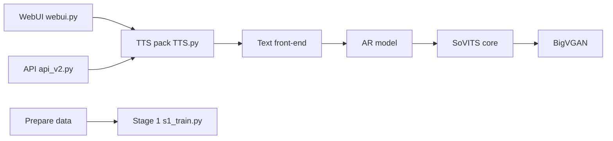

# RVC-Boss/GPT-SoVITS

> WebUI de synthèse vocale et clonage de voix few-shot, avec outils de préparation de dataset.

## Le problème
Cloner une voix demande habituellement des heures d'audio propre et une chaîne de préparation (découpe, ASR, étiquetage) à monter soi-même.

## Ce que ça fait vraiment
TTS zero-shot à partir de 5 s d'échantillon, fine-tuning avec 1 min de données ; chinois, anglais, japonais, coréen, cantonais.
Pipeline : normalisation/phonémisation → modèle AR texte→sémantique → décodeur SoVITS → vocodeur BigVGAN.
Outils intégrés : séparation voix/accompagnement (UVR5), découpe audio, ASR (FunASR, Faster Whisper), étiquetage.
Entrées : `webui.py`, `inference_webui.py`, `api.py`/`api_v2.py`, export ONNX/TorchScript.

## Comment c'est branché


## Essayer
```bash
conda create -n GPTSoVits python=3.10
conda activate GPTSoVits
bash install.sh --device <CU126|CU128|ROCM|CPU> --source <HF|HF-Mirror|ModelScope> [--download-uvr5]
python webui.py <language(optional)>
```

## Coût et pièges
GPU CUDA conseillé (entraînement sur Mac de qualité moindre), FFmpeg requis, modèles pré-entraînés à télécharger à part. 895 issues ouvertes.

## Ce que ce n'est pas
Pas une bibliothèque Python propre à importer : c'est une appli avec scripts. Documentation en partie en chinois. Le clonage de voix d'autrui pose des questions légales non traitées par le README.

## Alternatives
- baicai-1145/GPT-SoVITS-CPUFast : version optimisée pour l'inférence CPU.

## Pour toi
Bon terrain pour un POC TTS multilingue local ; pas une brique à intégrer telle quelle en prod.
