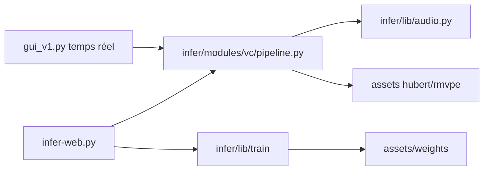

# RVC-Project/Retrieval-based-Voice-Conversion-WebUI

> Interface web d'entraînement et d'inférence de conversion de voix, pour bidouilleurs audio.

## Le problème
Cloner un timbre de voix demandait beaucoup de données et un gros GPU.

## Ce que ça fait vraiment
Basé sur VITS : remplace les traits de la voix source par ceux du jeu d'entraînement (recherche top-1) pour limiter la fuite de timbre. Entraînement avec ~10 min de voix, extraction de hauteur RMVPE, fusion de modèles, séparation voix/accompagnement (pymss/MSST), conversion temps réel (~170 ms annoncés). WebUI Gradio sur le port 7865.

## Comment c'est branché


## Essayer
```bash
python -m pip install -r requirments_cpu_py312.txt
hf download lj1995/VoiceConversionWebUI --revision main --include "hubert_base/*" --local-dir assets
python webui.py
```

## Coût et pièges
GPU NVIDIA recommandé (CUDA 11.8 ou 12.8), sinon CPU/DirectML. Python 3.12 imposé sur cette branche ; téléchargement de plusieurs modèles.

## Ce que ce n'est pas
Pas un TTS : il transforme une voix existante. Le cadre légal du clonage de voix n'est pas abordé.

## Alternatives
Aucune nommée comme alternative (VITS, HIFIGAN, ContentVec sont des briques).

## Pour toi
Hors cœur data/MLOps ; à regarder seulement pour un projet audio.
