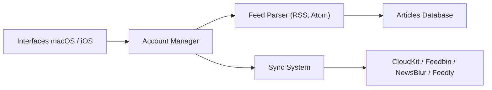

# Ranchero-Software/NetNewsWire

> Lecteur de flux RSS libre pour macOS et iOS, dont le README fourni ne décrit que la compilation.

## Le problème
Le README fourni ne le dit pas ; d'après l'architecture, l'app sert à suivre des flux RSS et Atom en local ou via des services.

## Ce que ça fait vraiment
Le README lu ne contient que les règles de contribution et la compilation. D'après le code : deux interfaces (macOS et iOS), une gestion de comptes (CloudKit, Feedbin, NewsBlur, Feedly, Reader API), un analyseur RSS/Atom, une base d'articles et une base de synchronisation, ainsi que des extensions (widget, partage).

## Comment c'est branché


## Essayer
```bash
git clone https://github.com/Ranchero-Software/NetNewsWire.git
chmod +x setup.sh
./setup.sh
```

## Coût et pièges
Compilation sans compte développeur payant possible, mais avec des fonctions coupées : iCloud, Feedly et le mode lecteur sont désactivés faute de clés d'API partagées. Le README demande de poser la question avant toute PR.

## Ce que ce n'est pas
Ce n'est pas un projet multiplateforme : Apple uniquement. README tronqué ici : présentation et téléchargement absents.

## Alternatives
Aucune alternative nommée dans le README.

## Pour toi
À ignorer : lecteur RSS pour Apple, sans lien avec un travail data/IA ; la fiche est de toute façon maigre faute de README complet.

