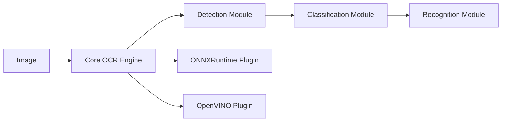

# RapidAI/RapidOCR

> OCR hors ligne multi-moteurs, basé sur les modèles PaddleOCR convertis en ONNX.

## Le problème
PaddleOCR est lourd à déployer ; il faut un OCR léger, hors ligne et multiplateforme.

## Ce que ça fait vraiment
Il convertit les modèles PaddleOCR en ONNX et les exécute via onnxruntime, OpenVINO, Paddle, PyTorch, TensorRT ou MNN.
La chaîne va de la détection à la classification, puis à la reconnaissance et au post-traitement.
Chinois et anglais par défaut, d'autres langues via la liste des modèles.
Ce dépôt ne contient que la partie Python ; les autres langages ont leurs propres dépôts.

## Comment c'est branché


## Essayer
```bash
pip install rapidocr onnxruntime
make build-onnxruntime-cpu
make test-onnxruntime-cpu
```

## Coût et pièges
Gratuit, CPU suffisant. La documentation complète n'existe qu'en chinois.

## Ce que ce n'est pas
Pas un outil d'entraînement : le fine-tuning se fait dans PaddleOCR, puis on redéploie ici.

## Alternatives
- PaddleOCR : pour affiner les modèles sur tes propres données.

## Pour toi
À adopter comme brique OCR légère dans un pipeline documentaire : Docling et Langchain l'utilisent déjà, et il tourne sur CPU.
