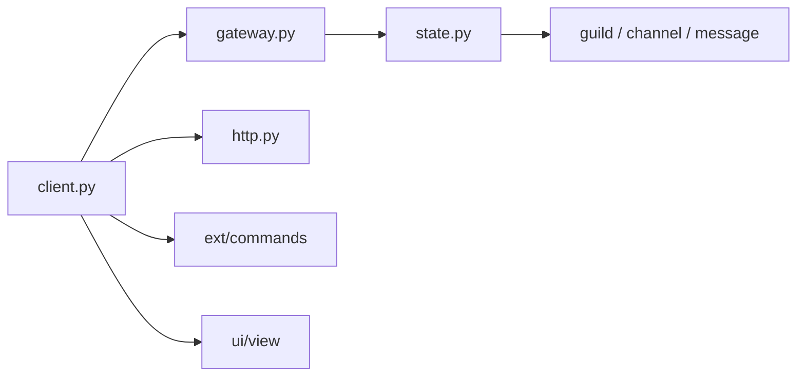

# Rapptz/discord.py

> Bibliothèque Python asynchrone pour écrire des bots et clients Discord.

## Le problème
Parler à l'API Discord (REST, Gateway WebSocket, voix) exige de gérer limites de débit, reconnexions et cache d'état.

## Ce que ça fait vraiment
Une API `async`/`await` qui gère la limitation de débit, le cycle de vie du client, la passerelle (avec sharding), l'état en cache, les commandes préfixées (`ext.commands`), les commandes d'application, les interactions et composants d'interface (vues, boutons, menus, modales), et la voix en option (PyNaCl).

## Comment c'est branché


## Essayer
```bash
python3 -m pip install -U discord.py
python3 -m pip install -U "discord.py[voice]"
```
```py
client = MyClient(intents=intents)
client.run('token')
```

## Coût et pièges
Python 3.8+, jeton de bot à créer. Dépend entièrement de la plateforme Discord. Voix sous Linux : `libffi-dev` et `python-dev` à installer.

## Ce que ce n'est pas
Ce n'est pas une plateforme de bots hébergée. Il faut activer l'intent `message_content` pour lire les messages.

## Alternatives
Aucune alternative nommée dans le README.

## Pour toi
À surveiller : utile pour un bot d'alerte ou de notification lié à un pipeline ML dans Discord ; sinon hors sujet.

