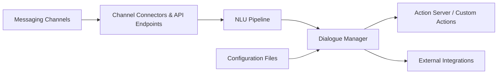

# RasaHQ/rasa

> Framework open source d'assistants conversationnels (NLU + dialogue), désormais en maintenance.

## Le problème
Construire un chatbot contextuel multi-canal demande compréhension d'intention, gestion d'état de dialogue et connecteurs vers chaque messagerie.

## Ce que ça fait vraiment
Pipeline NLU (tokenizers, featurizers, classifieurs) qui extrait intentions et entités.
Gestionnaire de dialogue à politiques qui suit l'état et déclenche des actions, y compris un serveur d'actions personnalisées.
Connecteurs Messenger, Slack, Telegram, Twilio, Mattermost et autres ; brokers d'événements (Kafka, SQL).
Le README met en avant Hello Rasa et CALM, l'offre suivante basée LLM.

## Comment c'est branché


## Essayer
```bash
make install
make prepare-tests-ubuntu
make test
```

## Coût et pièges
Gratuit, installation via Poetry. Les commandes du README sont celles du développement, pas d'une installation utilisateur.

## Ce que ce n'est pas
Plus un projet actif : « maintenance mode ». Hello Rasa n'est pas ce dépôt, c'est un playground hébergé qui sert de porte vers la plateforme commerciale.

## Alternatives
- Hello Rasa / CALM : la voie recommandée par l'éditeur, orientée LLM.

## Pour toi
À ignorer pour un nouveau projet : l'approche par intentions est dépassée par les LLM et l'éditeur lui-même a basculé ailleurs.
