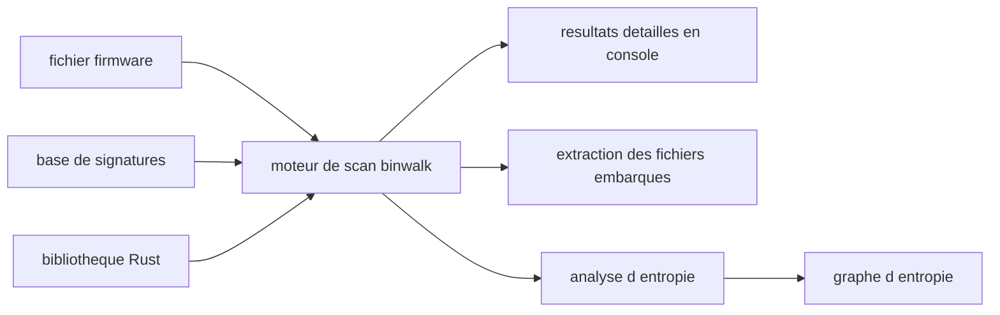

# ReFirmLabs/binwalk

> **Command-line firmware analysis tool.** For anyone who must find and pull files out of an opaque binary.

## The problem

A firmware image is a blob with no table of contents: archives, filesystems and compressed
images sit back to back. Without signature recognition you read bytes by hand to find where
each part begins, and extracting them is harder still.

## What it actually does

Binwalk identifies, and optionally extracts, files and data embedded inside other files. Its
primary focus is firmware analysis, but the README claims support for a wide variety of file
and data types, listed on a dedicated wiki page of supported signatures. It also offers
entropy analysis, presented as a way to help spot unknown compression or encryption. Version
3 is a rewrite of the tool in Rust, and it can be used as a Rust library inside your own
projects. The README documents no options in detail: it points to `--help` and the wiki.

## How it is wired



The README describes no internal architecture, so this diagram is inferred from what it
announces. A file goes in, a Rust engine matches it against a signature base documented in
the wiki, and three things come out: a console report, optional extraction of recognised
files, and entropy analysis that can produce graphs. The same engine is reachable as a Rust
library from a third-party project.

## Trying it

```bash
binwalk DIR-890L_AxFW110b07.bin
```

That is the only command in the README. Installation itself is not spelled out there: it
links to three wiki pages (build a Docker image, install via the Rust package manager,
compile from source) without repeating any commands.

## Cost and traps

Free, MIT licence declared, no API key and no third-party service. The real cost is getting
it installed: the path presented as easiest is building a Docker image, so Docker is needed;
the other two assume a Rust toolchain (cargo or a source build). The main trap is that the
README is an index of wiki links — supported signatures, options, entropy graphs all live
outside the text you can read here. Note too that the README calls usage "simple" and
analysis "fast" with no figures behind it: that is a slogan, not a measurement.

## What it is not

It is not a disassembler or a code analysis tool: binwalk works on the structure of a blob,
not on the instructions inside it. It is not a decryptor — entropy analysis helps you suspect
encryption, it does not remove it. It is not a GUI or a service either, but a command-line
executable, and extracting exotic formats depends on external dependencies the README does
not list.

## Alternatives

The README names no competing project, and no neighbours were supplied for this repository:
no comparable alternative in the catalogue. The only real choice is internal — between the
three installation routes (Docker, cargo, source build) and between command-line use and the
embedded Rust library.

## For you

Indirect value for a data / AI / MLOps profile: this is an embedded-security tool, not a
modelling one. It earns its place the day you must open an unknown firmware or binary blob —
device audit, forensics, recovering a model or dataset packed inside an image. Keep it in
reserve, not in the daily toolbox.
