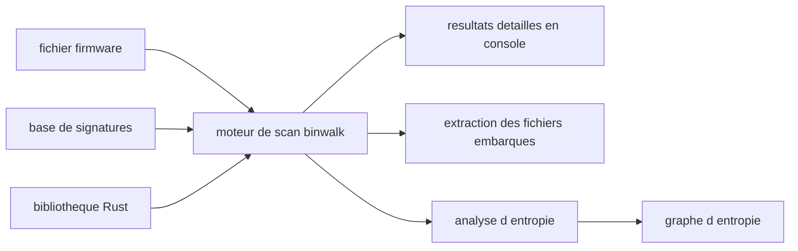

# ReFirmLabs/binwalk

> **Analyseur de firmware en ligne de commande.** Pour qui doit repérer et extraire des fichiers enfouis dans un binaire.

## Le problème

Un firmware est un blob opaque : archives, systèmes de fichiers et images compressées y sont
concaténés sans table des matières. Sans outil de reconnaissance de signatures, il faut lire
l'octet à la main pour savoir où commence quoi, et encore plus pour en extraire le contenu.

## Ce que ça fait vraiment

Binwalk identifie, et optionnellement extrait, des fichiers et des données embarqués à
l'intérieur d'autres fichiers. Sa cible première est l'analyse de firmware, mais le README
annonce la prise en charge d'une large variété de types de fichiers et de données, listée
dans une page de wiki dédiée aux signatures supportées. Il propose aussi une analyse
d'entropie, présentée comme une aide pour repérer une compression ou un chiffrement inconnus.
Cette version 3 est une réécriture en Rust de l'outil, et elle s'expose aussi comme
bibliothèque Rust à intégrer dans ses propres projets. Le README ne documente pas le détail
des options : il renvoie à `--help` et au wiki.

## Comment c'est branché



Le README ne décrit aucune architecture interne : ce schéma est déduit de ce qu'il annonce.
On donne un fichier en entrée, un moteur écrit en Rust le confronte à une base de signatures
documentée dans le wiki, et il en sort trois choses : un rapport en console, une extraction
optionnelle des fichiers reconnus, et une analyse d'entropie pouvant produire des graphes.
Le même moteur est accessible en tant que bibliothèque Rust depuis un projet tiers.

## Essayer

```bash
binwalk DIR-890L_AxFW110b07.bin
```

C'est la seule commande présente dans le README. L'installation elle-même n'y est pas
détaillée : il renvoie à trois pages de wiki (image Docker, installation via le gestionnaire
de paquets Rust, compilation depuis les sources) sans recopier les commandes.

## Coût et pièges

Gratuit, licence MIT déclarée, pas de clé d'API ni de service tiers. Le vrai coût est
l'installation : le chemin présenté comme le plus simple est la construction d'une image
Docker, donc il faut Docker ; les deux autres chemins supposent une chaîne Rust (cargo ou
compilation depuis les sources). Piège principal de cette fiche : le README est un index de
liens vers le wiki, tout ce qui est opérationnel — signatures supportées, options, graphes
d'entropie — vit hors du dépôt tel qu'on le lit ici. À noter aussi, le README qualifie
lui-même l'usage de « simple » et l'analyse de « fast » sans chiffre à l'appui : c'est du
slogan, pas une mesure.

## Ce que ce n'est pas

Ce n'est pas un désassembleur ni un outil d'analyse de code : binwalk travaille sur la
structure d'un blob, pas sur les instructions qu'il contient. Ce n'est pas un déchiffreur :
l'analyse d'entropie aide à *soupçonner* du chiffrement, elle ne l'enlève pas. Ce n'est pas
non plus une interface graphique ni un service, mais un exécutable en ligne de commande, et
l'extraction de formats exotiques dépend de dépendances externes que le README ne liste pas.

## Alternatives

Le README ne cite aucun projet concurrent, et aucun voisin n'est fourni pour ce dépôt :
aucune alternative comparable dans le catalogue. Le seul choix réellement offert est interne,
entre les trois modes d'installation (Docker, cargo, compilation) et entre l'usage en ligne
de commande ou en bibliothèque Rust embarquée.

## Pour toi

Intérêt indirect pour un profil data / IA / MLOps : c'est un outil de sécurité embarquée, pas
de modélisation. Il devient utile le jour où il faut ouvrir un firmware ou un blob binaire
inconnu — audit d'un appareil, forensic, récupération d'un modèle ou d'un dataset empaqueté
dans une image. À garder en réserve, pas dans la boîte à outils quotidienne.
