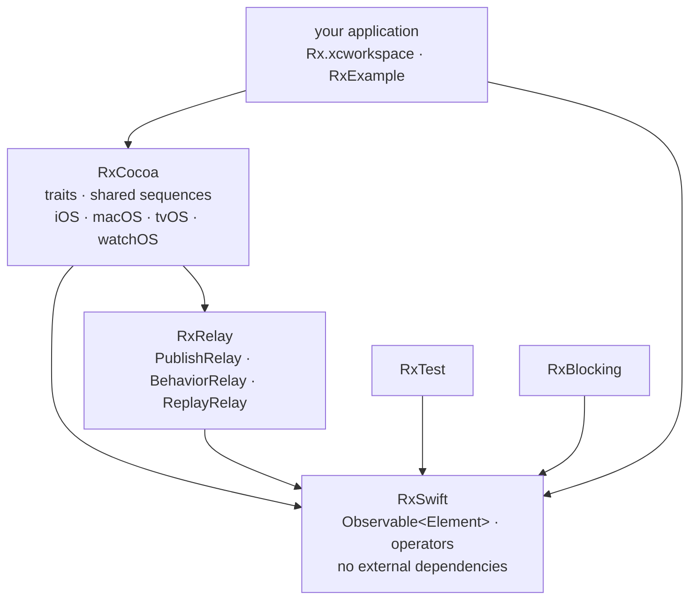

# ReactiveX/RxSwift

> **Reactive programming in Swift: composable event streams for Apple-platform applications.**

## The problem

Without a shared abstraction, an Apple application juggles four separate asynchrony
mechanisms — KVO, delegates, completion blocks, UI events — that must be stitched together by
hand as soon as you need to debounce typing, cancel a request that has become stale, or merge
two sources. The resulting code is scattered and hard to test.

## What it actually does

RxSwift is the Swift-specific implementation of the [Reactive Extensions](http://reactivex.io)
standard. It exposes an `Observable<Element>` interface: you broadcast values and events,
subscribe to them, transform and compose them. The README states the central idea — KVO,
async operations, UI events and other data streams are all unified under one *sequence
abstraction*.

The repository ships five components that depend on each other: **RxSwift** (the core, with no
external dependencies), **RxCocoa** (Cocoa-specific capabilities for iOS/macOS/watchOS/tvOS:
shared sequences, traits), **RxRelay** (`PublishRelay`, `BehaviorRelay`, `ReplayRelay`, wrappers
around Subjects), plus **RxTest** and **RxBlocking** for testing Rx-based systems. The traits —
`Single`, `Completable`, `Maybe`, `Driver`, `ControlProperty` — have their own documentation.
Announced platforms: iOS, macOS, tvOS, watchOS and Linux.

The README's example is a GitHub repository search: `searchBar.rx.text.orEmpty`,
`.throttle(.milliseconds(300), scheduler: MainScheduler.instance)`, `.distinctUntilChanged()`,
`.flatMapLatest { … }`, then `.bind(to: tableView.rx.items(...))` and `.disposed(by: disposeBag)`.

## How it is wired



No code-derived diagram exists for this repository: this graph restates the ASCII component
chart drawn in the README, with arrows following the dependencies it describes.

## Trying it

```bash
$ carthage update
```

Or, with Swift Package Manager, after creating a `Package.swift` declaring
`.package(url: "https://github.com/ReactiveX/RxSwift.git", .upToNextMajor(from: "6.0.0"))`:

```bash
$ swift build
$ TEST=1 swift test
```

Or as a git submodule, then dragging `Rx.xcodeproj` into the Project Navigator:

```bash
$ git submodule add git@github.com:ReactiveX/RxSwift.git
```

For Carthage as a static library, the README gives the workaround:

```bash
carthage update RxSwift --platform iOS --no-build
sed -i -e 's/MACH_O_TYPE = mh_dylib/MACH_O_TYPE = staticlib/g' Carthage/Checkouts/RxSwift/Rx.xcodeproj/project.pbxproj
carthage build RxSwift --platform iOS
```

The manual route is described without a command: open `Rx.xcworkspace`, pick `RxExample` and
hit run.

## Cost and gotchas

- **No API key, no GPU, no third-party service**: the library is free, has no external
  dependencies, and the README mentions neither telemetry nor quotas.
- **The cost is the Apple toolchain**: Xcode, an `xcworkspace`, and a dependency manager
  (Carthage, Swift Package Manager or a git submodule). The README documents neither CocoaPods
  nor a minimum Swift version beyond the `// swift-tools-version:5.0` of its example.
- **A Swift Package Manager bug flagged by the authors themselves**: a cross-dependency issue
  (SR-12303, filed in early 2020) affects RxSwift; the README warns that "your mileage may
  vary" and links to a partial workaround in an issue.
- **XCFramework binaries** since RxSwift 6, signed with an Apple Developer account under the
  team name *Shai Mishali*: verify it before embedding them.
- **The real cost is cognitive**: Rx is a full mental model (hot/cold, subjects, schedulers,
  `DisposeBag`), and most of the README is learning documentation — a sign that getting
  started is not immediate.

## What it is not

- **Not an application framework or a UI layer**: RxSwift draws nothing and imposes no
  architecture. It is a stream abstraction; MVVM or anything else remains your job.
- **Not broadly cross-platform**: despite the Linux mention, the substance (RxCocoa, traits,
  the example) targets Apple platforms. Nothing for Android or the web.
- **Not the platform-native answer**: Apple ships Combine, and the README itself links to a
  comparison document. Choosing RxSwift today means deliberately choosing against the
  framework the platform provides.

## Alternatives

| | When to prefer it |
|---|---|
| **Combine** | Referenced in the README through its comparison document. It is Apple's own reactive framework, with no dependency to add. Prefer it on a new project that can target recent OS versions; prefer RxSwift to cover older systems or to share Rx conventions with an Android/JS team. |
| **ReactiveSwift** | Also cited in the README's comparison: another Swift reactive library with its own vocabulary. Prefer it if the team already knows it; RxSwift if you want the standard ReactiveX operator names. |

The catalogue's suggested neighbours (`onevcat/Kingfisher`, `SwifterSwift/SwifterSwift`,
`Juanpe/SkeletonView`, `Quick/Quick`) are Swift libraries too, but none deals with composing
asynchronous streams: they are not alternatives.

## For you

Worth watching, not adopting: for a data / AI / MLOps profile, RxSwift only matters if you
ship an iOS application embedding a model. The concept still repays a read — the ReactiveX
operator vocabulary (`throttle`, `distinctUntilChanged`, `flatMapLatest`) is the same one used
in data-side stream processing, and the README is a good entry point into that mental model.
