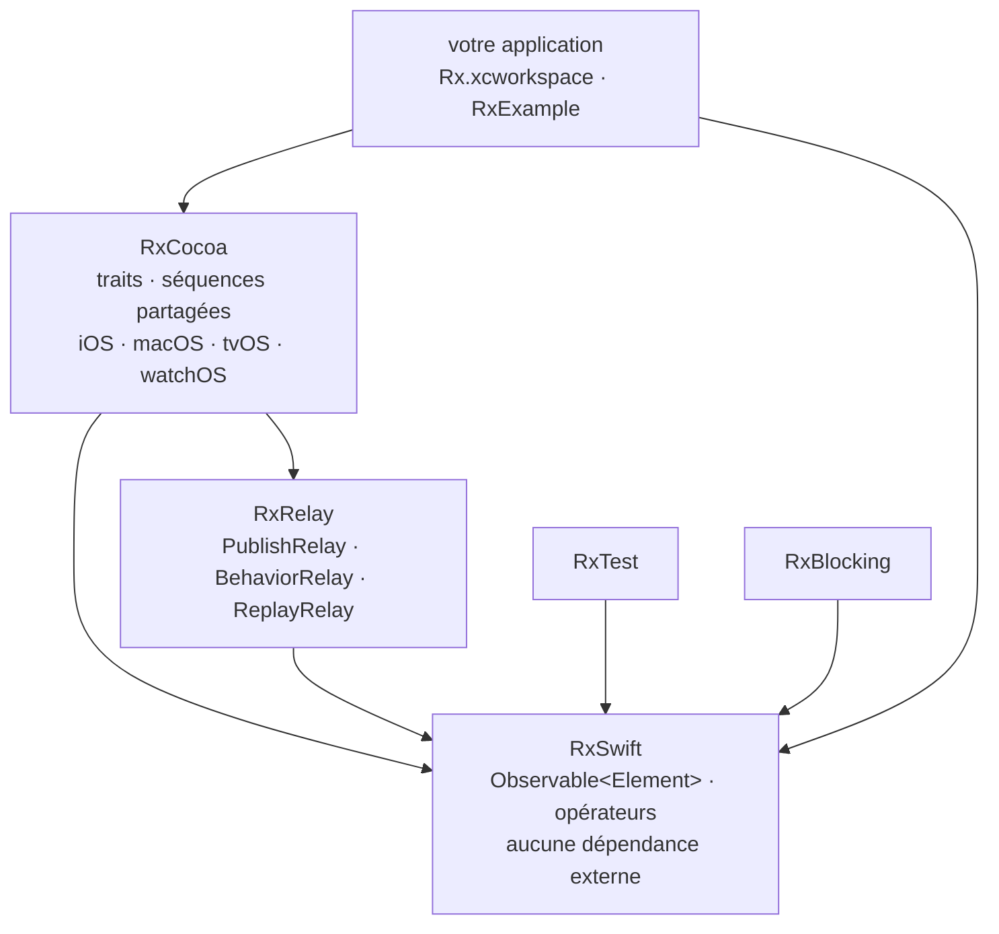

# ReactiveX/RxSwift

> **La programmation réactive en Swift : flux d'événements composables pour applications Apple.**

## Le problème

Sans abstraction commune, une application Apple jongle avec quatre mécanismes d'asynchrone
distincts — KVO, `delegate`, blocs de complétion, événements d'interface — qu'il faut recoller
à la main dès qu'il s'agit de temporiser une saisie, annuler une requête devenue obsolète ou
combiner deux sources. Le code qui en résulte est éparpillé et difficile à tester.

## Ce que ça fait vraiment

RxSwift est l'implémentation Swift du standard [Reactive Extensions](http://reactivex.io).
Elle expose une interface `Observable<Element>` : on diffuse des valeurs et des événements,
on s'y abonne, on les transforme et on les compose. Le README pose le principe central —
KVO, opérations asynchrones, événements d'interface et autres flux sont tous ramenés à une
même *abstraction de séquence*.

Le dépôt livre cinq composants qui dépendent les uns des autres : **RxSwift** (le cœur, sans
aucune dépendance externe), **RxCocoa** (ce qui est spécifique à Cocoa pour iOS/macOS/watchOS/tvOS :
séquences partagées, traits), **RxRelay** (`PublishRelay`, `BehaviorRelay`, `ReplayRelay`,
enveloppes autour des sujets), **RxTest** et **RxBlocking** (tests de systèmes fondés sur Rx).
Les *traits* — `Single`, `Completable`, `Maybe`, `Driver`, `ControlProperty` — sont documentés
à part. Plateformes annoncées : iOS, macOS, tvOS, watchOS et Linux.

L'exemple du README est une recherche de dépôts GitHub : `searchBar.rx.text.orEmpty`,
`.throttle(.milliseconds(300), scheduler: MainScheduler.instance)`, `.distinctUntilChanged()`,
`.flatMapLatest { … }`, puis `.bind(to: tableView.rx.items(...))` et `.disposed(by: disposeBag)`.

## Comment c'est branché



Aucun diagramme tiré du code n'existe pour ce dépôt : ce schéma reprend le graphe de
composants dessiné en ASCII dans le README, et le sens des flèches est celui des dépendances
qui y sont décrites.

## Essayer

```bash
$ carthage update
```

Ou, avec Swift Package Manager, après avoir créé un `Package.swift` déclarant
`.package(url: "https://github.com/ReactiveX/RxSwift.git", .upToNextMajor(from: "6.0.0"))` :

```bash
$ swift build
$ TEST=1 swift test
```

Ou en sous-module git, puis en glissant `Rx.xcodeproj` dans le navigateur de projet :

```bash
$ git submodule add git@github.com:ReactiveX/RxSwift.git
```

Pour Carthage en bibliothèque statique, le README donne le contournement :

```bash
carthage update RxSwift --platform iOS --no-build
sed -i -e 's/MACH_O_TYPE = mh_dylib/MACH_O_TYPE = staticlib/g' Carthage/Checkouts/RxSwift/Rx.xcodeproj/project.pbxproj
carthage build RxSwift --platform iOS
```

La voie manuelle est décrite sans commande : ouvrir `Rx.xcworkspace`, choisir `RxExample` et
lancer l'exécution.

## Coût et pièges

- **Pas de clé d'API, pas de GPU, pas de service tiers** : la bibliothèque est gratuite, sans
  dépendance externe, et le README ne mentionne aucune télémétrie ni aucun quota.
- **Le coût est l'outillage Apple** : Xcode, un `xcworkspace`, un gestionnaire de dépendances
  (Carthage, Swift Package Manager ou sous-module git). Le README ne documente ni CocoaPods ni
  version minimale de Swift au-delà du `// swift-tools-version:5.0` de l'exemple.
- **Bug Swift Package Manager signalé par les auteurs eux-mêmes** : un problème de
  dépendances croisées (SR-12303, ouvert début 2020) affecte RxSwift ; le README prévient que
  « your mileage may vary » et renvoie à un contournement partiel dans une issue.
- **Binaires XCFramework** depuis RxSwift 6, signés avec un compte Apple Developer au nom de
  *Shai Mishali* : à vérifier avant de les embarquer.
- **Le vrai coût est cognitif** : Rx est un modèle mental complet (chaud/froid, sujets,
  ordonnanceurs, `DisposeBag`), et le README consacre l'essentiel de sa place à de la
  documentation d'apprentissage — signe que la prise en main n'est pas immédiate.

## Ce que ce n'est pas

- **Ce n'est pas un cadre d'application ni une couche d'interface** : RxSwift ne dessine rien
  et n'impose pas d'architecture. C'est une abstraction de flux ; MVVM ou autre reste à votre
  charge.
- **Ce n'est pas multiplateforme au sens large** : malgré la mention de Linux, l'essentiel
  (RxCocoa, les traits, l'exemple) vise l'écosystème Apple. Rien pour Android ni pour le web.
- **Ce n'est pas la solution native** : Apple fournit Combine, et le README lui-même renvoie à
  un document de comparaison. Adopter RxSwift aujourd'hui, c'est faire un choix contre le
  cadre fourni par la plateforme, en connaissance de cause.

## Alternatives

| | Quand le préférer |
|---|---|
| **Combine** | Cité dans le README via son document de comparaison. C'est le cadre réactif d'Apple, sans dépendance à ajouter. À préférer sur un projet neuf qui peut fixer une cible système récente ; RxSwift à préférer pour couvrir des systèmes plus anciens ou partager les conventions Rx avec une équipe Android/JS. |
| **ReactiveSwift** | Également cité dans la comparaison du README : autre bibliothèque réactive Swift, avec son vocabulaire propre. À préférer si l'équipe y est déjà formée ; RxSwift si l'on tient aux noms d'opérateurs ReactiveX standard. |

Les voisins proposés par le catalogue (`onevcat/Kingfisher`, `SwifterSwift/SwifterSwift`,
`Juanpe/SkeletonView`, `Quick/Quick`) sont bien des bibliothèques Swift, mais aucune ne traite
de composition de flux asynchrones : ce ne sont pas des alternatives.

## Pour toi

À surveiller, pas à adopter : pour un profil data / IA / MLOps, RxSwift n'a d'intérêt que si
vous livrez une application iOS embarquant un modèle. Le concept vaut malgré tout la lecture —
le vocabulaire d'opérateurs de ReactiveX (`throttle`, `distinctUntilChanged`, `flatMapLatest`)
est le même que celui des traitements de flux côté données, et le README est une bonne porte
d'entrée sur ce modèle mental.
