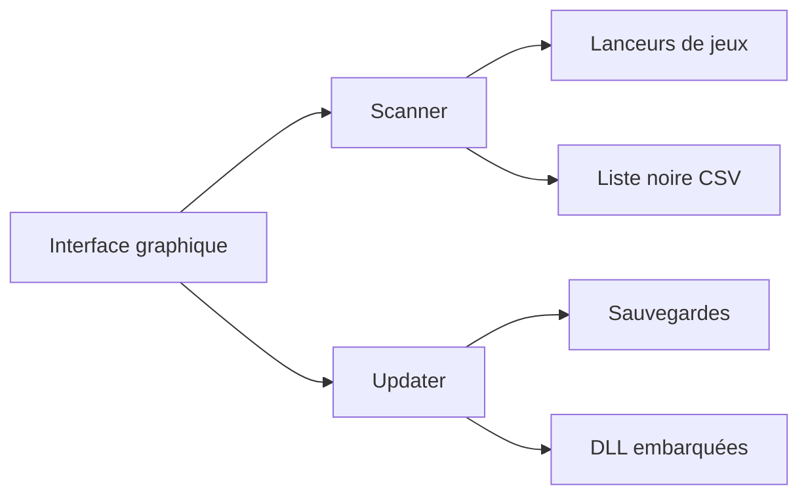

# Recol/DLSS-Updater

> Application Windows et Linux qui met à jour en un point les DLL DLSS, XeSS et FSR des jeux installés.

## Le problème
Chaque jeu embarque sa propre version des DLL d'upscaling, souvent en retard ; les remplacer à la main est long.

## Ce que ça fait vraiment
Détecte les jeux Steam, Epic, GOG, Ubisoft, EA, Battle.net, Xbox, remplace les DLL par les versions embarquées (avec sauvegarde restaurable), applique des préréglages DLSS via le profil pilote NVIDIA sous Windows, et génère des options de lancement Proton sous Linux. Liste noire de jeux communautaire, mise à jour automatique.

## Comment c'est branché


## Essayer
```bash
winget install "DLSS Updater"
flatpak install --user DLSS_Updater-X.Y.Z.flatpak
flatpak run io.github.recol.dlss-updater
```

## Coût et pièges
Sauvegarde avant chaque modification. Les réglages globaux Windows sont marqués expérimentaux ; les jeux à anti-cheat ne sont pas exclus globalement, seulement au cas par cas. La liste noire est dans un autre dépôt. Le schéma fourni (PyQt6, Python 3.12) diffère du README (Python 3.14, uv).

## Ce que ce n'est pas
Pas un outil de jeu généraliste : il modifie des fichiers de jeu, ce qui peut poser des problèmes de compatibilité ou de bannissement.

## Alternatives
Aucune alternative nommée dans le README.

## Pour toi
Ignorer : utilitaire de joueur PC, AGPL-3.0, sans rapport avec la data ou l'IA.

