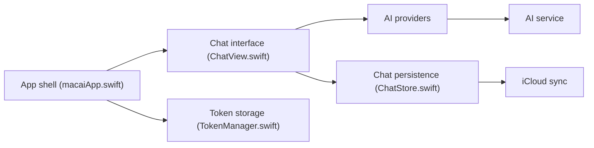

# Renset/macai

> Client de chat IA natif pour macOS, compatible avec la plupart des fournisseurs de LLM.

## Le problème
Utiliser plusieurs fournisseurs de LLM depuis des interfaces web dispersées, sans client léger et natif sur Mac.

## Ce que ça fait vraiment
App SwiftUI : configure des services d'API (OpenAI, Claude, xAI, Gemini, Perplexity, Ollama, OpenRouter, tout endpoint compatible OpenAI), des personas, pièces jointes, import/export et synchronisation iCloud optionnelle. Les conversations sont stockées localement (Core Data). Le README annonce vision, génération d'images, recherche et raisonnement sans détailler.

## Comment c'est branché


## Essayer
```bash
brew install --cask macai
ollama pull <model>
```

## Coût et pièges
Gratuit ; les appels aux API commerciales sont facturés par le fournisseur (clé requise). Avec Ollama, tout reste local. Sans compte développeur Apple, compilation possible sans iCloud. macOS 14+.

## Ce que ce n'est pas
Pas un agent ni un outil de développement : un client de chat. Aucune télémétrie de macai, mais Apple peut en collecter avec iCloud.

## Alternatives
Aucune alternative nommée dans le README.

## Pour toi
À surveiller : pratique si tu jongles entre plusieurs modèles et Ollama sur Mac ; sinon une interface web suffit.

