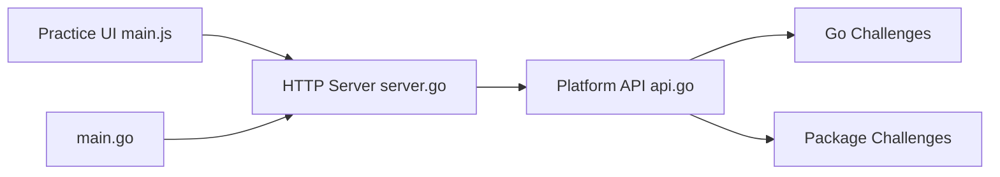

# RezaSi/go-interview-practice

> Plateforme d'exercices Go avec tests automatiques, classements et retours IA, pour préparer des entretiens.

## Le problème
Apprendre Go pour des entretiens techniques demande des exercices testés et un retour sur sa solution.

## Ce que ça fait vraiment
30 défis (débutant à avancé) et 26 défis par paquet (cobra, echo, fiber, gin, gorm, mongodb). Une interface web en Go lance les tests, mesure temps et mémoire, met à jour des classements et des badges via GitHub Actions. Simulation d'entretien par IA optionnelle (Gemini, OpenAI ou Claude).

## Comment c'est branché


## Essayer
```bash
git clone https://github.com/yourusername/go-interview-practice.git
cd go-interview-practice/web-ui
go run main.go
./create_submission.sh 1
cd challenge-1 && ./run_tests.sh
```

## Coût et pièges
Gratuit ; fork obligatoire avant de cloner. Clé Gemini (niveau gratuit cité) pour les fonctions IA. Une version hébergée existe sur app.gointerview.dev.

## Ce que ce n'est pas
Pas un cours de Go : ce sont des exercices. La licence n'est pas identifiée par GitHub.

## Alternatives
Aucune alternative nommée dans le README.

## Pour toi
À ignorer : utile seulement si tu prépares des entretiens Go, pas pour un profil data/IA/MLOps en Python.

