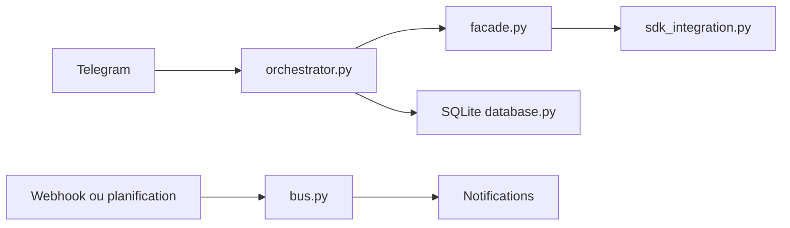

# RichardAtCT/claude-code-telegram

> Bot Telegram qui donne un accès distant à Claude Code pour discuter de ses projets depuis un téléphone.

## Le problème
Utiliser Claude Code oblige à rester devant un terminal ; on veut déclencher ou suivre du travail de code de n'importe où.

## Ce que ça fait vraiment
Reçoit les messages Telegram, les transmet à Claude (SDK en principal, CLI en secours), garde une session par utilisateur et par projet dans SQLite. Deux modes : agentique (conversationnel) et classique (13 commandes). Ajoute webhooks GitHub, tâches planifiées (cron), notifications, envoi de fichiers et d'images, transcription vocale, suivi de coûts, liste blanche d'utilisateurs, bac à sable de répertoire, limitation de débit et journal d'audit.

## Comment c'est branché


## Essayer
```bash
uv tool install git+https://github.com/overwirehq/claude-code-telegram@v1.3.0
cp .env.example .env
make run
```

## Coût et pièges
Token Telegram via @BotFather, Claude Code CLI, éventuellement `ANTHROPIC_API_KEY`. Limite de coût par utilisateur réglable (`CLAUDE_MAX_COST_PER_USER`). Le bot peut exécuter des commandes sur la machine : garder la liste blanche stricte.

## Ce que ce n'est pas
Pas un agent autonome à laisser ouvert. Aucune licence déclarée : l'usage et la réutilisation ne sont pas clarifiés. Système de plugins seulement « prévu ». Le README pointe vers un dépôt `overwirehq`, distinct du propriétaire catalogué.

## Alternatives
Aucune alternative nommée dans le README.

## Pour toi
À surveiller : pratique pour piloter ton agent depuis le mobile, mais sans licence et avec exécution de code à distance, à n'essayer que sur un environnement isolé.

