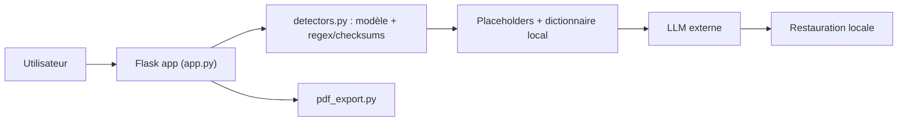

# Rizzo-AI-Academy/rizzo-pii

> Modèle d'anonymisation réversible de données personnelles pour textes juridiques italiens, en local sur CPU.

## Le problème
Coller des contrats dans ChatGPT ou Claude envoie noms, codes fiscaux et IBAN à un tiers, ce qui pose un souci RGPD.

## Ce que ça fait vraiment
Modèle ≈0,3 B (mmBERT) détectant 22 catégories, dont codice fiscale, P.IVA et données cadastrales, couplé à des regex et checksums (IBAN, carte, CF, PIVA). Remplace chaque valeur par un placeholder stable (`[FULLNAME_1]`), garde le dictionnaire en local, puis restaure la réponse du LLM. Micro-F1 0,989 sur validation réelle italienne. Appli de bureau Tauri, API Flask, export PDF réellement expurgé.

## Comment c'est branché


## Essayer
```bash
git clone https://github.com/Rizzo-AI-Academy/rizzo-pii
cd rizzo-pii
docker build -t rizzo-pii .
docker run -d --name rizzo-pii -p 127.0.0.1:5005:5005 rizzo-pii
curl localhost:5005/health
```

## Coût et pièges
CPU seulement, ~0,5–1,2 Go de RAM ; image Docker de 2,65 Go. Validation italienne uniquement, sur phrases courtes ; texte dans une image raster non expurgeable. Code MIT, mais binaires publiés sous AGPL-3.0 (PyMuPDF).

## Ce que ce n'est pas
Pas une garantie de conformité RGPD à lui seul : le README recommande de toujours garder le filet regex/checksum. Étiquettes ORG et CITY plus faibles.

## Alternatives
Le README compare à OpenAI Privacy Filter et Microsoft Presidio.

## Pour toi
À adopter si tu traites des documents sensibles italiens avant envoi à un LLM ; pour d'autres langues, la validation manque.
