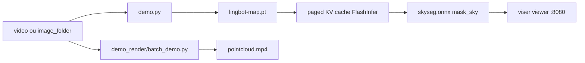

# Robbyant/lingbot-map

> Modèle feed-forward de reconstruction 3D en flux continu à partir d'une vidéo.

## Le problème
Reconstruire une scène 3D depuis une longue vidéo suppose habituellement une
optimisation itérative coûteuse, et la dérive s'accumule sur des milliers d'images.

## Ce que ça fait vraiment
Un « Geometric Context Transformer » unifie ancrage des coordonnées, indices
géométriques denses et correction de dérive longue portée via un contexte d'ancre,
une fenêtre de pose de référence et une mémoire de trajectoire. Attention sur KV
cache paginé (FlashInfer) pour tenir ~20 FPS en 518×378 sur des séquences de plus
de 10 000 images. Deux checkpoints publiés sur Hugging Face et ModelScope. Un
pipeline de rendu hors ligne produit un MP4 de survol de nuage de points.

## Comment c'est branché


## Essayer
```bash
conda create -n lingbot-map python=3.10 -y
pip install torch==2.8.0 torchvision==0.23.0 --index-url https://download.pytorch.org/whl/cu128
pip install -e .
python demo.py --model_path /path/to/lingbot-map.pt --image_folder example/courthouse --mask_sky
```

## Coût et pièges
GPU NVIDIA obligatoire, CUDA 12.8, PyTorch épinglé à 2.8.0 parce que Kaolin n'a pas
de wheel pour 2.9. Le pipeline de rendu exige de compiler deux extensions CUDA et
d'installer ffmpeg. Sans FlashInfer, repli sur SDPA. Mémoire : `--offload_to_cpu`
est actif par défaut, `--num_scale_frames 2` réduit le pic.

## Ce que ce n'est pas
Pas un outil prêt à l'emploi : la portée d'inférence est bornée par la distance vue
à l'entraînement, au-delà il faut passer en `--mode windowed`. L'entraînement n'est
pas publié, seulement l'inférence. Aucune licence déclarée dans le README.

## Alternatives
- VGGT : le modèle bidirectionnel dont le checkpoint stage-1 peut être chargé.
- DINOv2 : brique amont citée dans les remerciements.

## Pour toi
Hors périmètre data/MLOps sauf projet 3D explicite. À ignorer.
