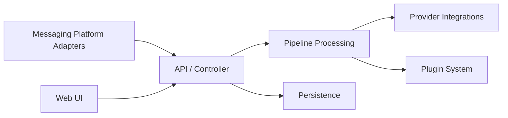

# RockChinQ/LangBot

> Plateforme pour brancher des LLM sur Slack, Discord, Telegram, WeChat et autres messageries, avec panneau web.

## Le problème
Relier un agent ou un flux Dify, n8n ou Langflow à plusieurs messageries demande un adaptateur par plateforme.

## Ce que ça fait vraiment
Adaptateurs de plateformes qui normalisent les messages, un pipeline (filtre de mots sensibles, limitation de débit, texte long), des fournisseurs de modèles, un système de plugins et un serveur MCP intégré à `/mcp`. Base SQLite par défaut, panneau d'administration Vue.js. Un démo public utilise des identifiants affichés dans le README.

## Comment c'est branché


## Essayer
```bash
uvx langbot
git clone https://github.com/langbot-app/LangBot
cd LangBot/docker
docker compose --profile all up -d
```

## Coût et pièges
Clés de modèles à ta charge ; version cloud payante ou freemium possible (non détaillé). Le dépôt de référence a changé (langbot-app/LangBot).

## Ce que ce n'est pas
Pas un framework d'agents : il connecte agents et messageries.

## Alternatives
- Dify, Coze, n8n, Langflow : intégrations citées comme moteurs de flux derrière le bot.

## Pour toi
À surveiller : utile si tu dois exposer un assistant interne dans Slack ou WeCom ; hors sujet sinon.
