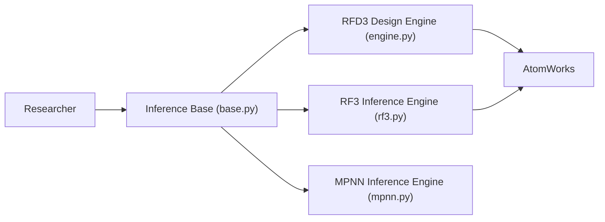

# RosettaCommons/foundry

> Boîte à outils RosettaCommons pour utiliser et entraîner des modèles de conception de protéines (RFD3, RF3, ProteinMPNN).

## Le problème
Les modèles de conception et de repliement de protéines sont dispersés, avec des outils de traitement de structures incompatibles entre eux.

## Ce que ça fait vraiment
Fournit l'infrastructure commune (inférence, entraînement, registre de points de contrôle) et quatre familles de modèles : RFD3 et RFD3NA (conception all-atom, acides nucléiques inclus), RF3 (prédiction de structure) et ProteinMPNN/LigandMPNN (repliement inverse). Tout repose sur AtomWorks pour manipuler les structures. Supporte aussi Intel XPU et Apple MPS (via un fork communautaire).

## Comment c'est branché


## Essayer
```bash
pip install "rc-foundry[all]"
foundry install base-models --checkpoint-dir <path/to/ckpt/dir>
foundry list-available
foundry list-installed
```

## Coût et pièges
Gratuit. Les poids se téléchargent séparément (`~/.foundry/checkpoints` par défaut) ; l'image Docker officielle les inclut. Le README précise que les tests ne sont pas supportés pour l'instant. 88 issues ouvertes. Sur Mac, précision float32 et inférence seule.

## Ce que ce n'est pas
N'est pas un service hébergé. Les licences des poids de modèles ne sont pas détaillées dans ce README (le dépôt est BSD-3-Clause).

## Alternatives
Aucune alternative nommée dans le README.

## Pour toi
À surveiller : référence sérieuse si tu fais de la conception de protéines en ML ; sans ce besoin, le domaine reste hors de ton périmètre.

