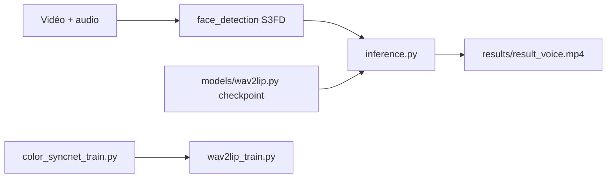

# Rudrabha/Wav2Lip

> Modèle de synchronisation labiale vidéo sur n'importe quel audio, en version de recherche non commerciale.

## Le problème
Aligner les lèvres d'un visage filmé sur un audio arbitraire est difficile et tient mal en conditions réelles.

## Ce que ça fait vraiment
Le README ouvre sur une version commerciale (API Sync, modèle `lipsync-2`, SDK Python et TypeScript, clé d'API). Le code open source est distinct : `inference.py` prend une vidéo de visage, un audio et un checkpoint, détecte le visage (S3FD) et produit la vidéo synchronisée. Entraînement en deux étapes (SyncNet expert, puis Wav2Lip, avec ou sans discriminateur de qualité) sur LRS2.

## Comment c'est branché


## Essayer
```bash
pip install -r requirements.txt
python inference.py --checkpoint_path <ckpt> --face <video.mp4> --audio <an-audio-source>
```

## Coût et pièges
Python 3.6, ffmpeg, poids à télécharger. Usage strictement non commercial (entraîné sur LRS2) ; le dépôt n'a aucune licence déclarée. La version de qualité est un service payant avec clé d'API. Dernier push le 2025-06-22.

## Ce que ce n'est pas
Pas libre d'usage commercial. Le README dit lui-même que la version commerciale est de bien meilleure qualité que l'ancien modèle open source.

## Alternatives
API Sync (sync.so), version commerciale hébergée par les mêmes auteurs.

## Pour toi
À surveiller : référence de recherche pour la lip-sync, mais inutilisable en production sans contrat commercial et ancienne.

